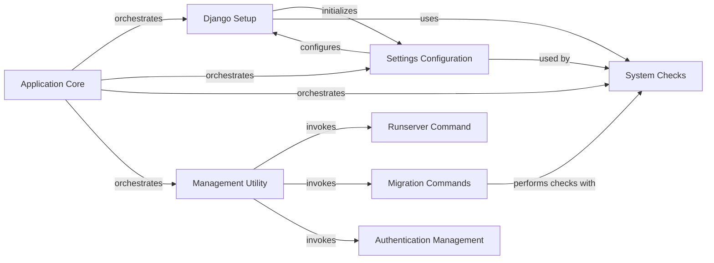

## Component Details

The Application Core component orchestrates the fundamental operations of a Django application, managing its lifecycle from initial setup and configuration loading to handling command-line utilities and performing system-wide health checks. It acts as the central hub, coordinating interactions between various sub-components to ensure the application runs correctly and efficiently.

### Application Core
Manages the overall application lifecycle, including loading configurations, handling settings, providing command-line utilities, and performing system-wide health checks.

**Related Classes/Methods**:

- `django.setup` (full file reference)
- `django.core.management.ManagementUtility:execute` (full file reference)
- <a href="https://github.com/django/django/blob/master/django/core/checks/registry.py#L72-L96" target="_blank" rel="noopener noreferrer">`django.core.checks.registry.CheckRegistry:run_checks` (72:96)</a>

### Django Setup
This component is responsible for the initial setup of the Django environment. It configures logging, sets the URL script prefix, and populates the application registry, making Django's various modules ready for use.

**Related Classes/Methods**:

- `django.setup` (full file reference)
- <a href="https://github.com/django/django/blob/master/django/utils/log.py#L67-L76" target="_blank" rel="noopener noreferrer">`django.utils.log.configure_logging` (67:76)</a>
- <a href="https://github.com/django/django/blob/master/django/urls/base.py#L120-L126" target="_blank" rel="noopener noreferrer">`django.urls.base.set_script_prefix` (120:126)</a>
- <a href="https://github.com/django/django/blob/master/django/apps/registry.py#L61-L127" target="_blank" rel="noopener noreferrer">`django.apps.registry.Apps.populate` (61:127)</a>

### Settings Configuration
This component handles the loading, validation, and access of Django project settings. It ensures that the application operates with a correct and consistent configuration, raising errors for improper setups.

**Related Classes/Methods**:

- `django.conf.LazySettings:_setup` (full file reference)
- `django.conf.Settings:__init__` (full file reference)
- <a href="https://github.com/django/django/blob/master/django/core/exceptions.py#L123-L126" target="_blank" rel="noopener noreferrer">`django.core.exceptions.ImproperlyConfigured` (123:126)</a>

### System Checks
This component provides a robust framework for running various system-wide health checks. It identifies potential configuration issues, common errors, and security vulnerabilities across different parts of a Django project, such as URLs, databases, models, and caches.

**Related Classes/Methods**:

- <a href="https://github.com/django/django/blob/master/django/core/checks/registry.py#L72-L96" target="_blank" rel="noopener noreferrer">`django.core.checks.registry.CheckRegistry:run_checks` (72:96)</a>
- <a href="https://github.com/django/django/blob/master/django/core/checks/registry.py#L34-L70" target="_blank" rel="noopener noreferrer">`django.core.checks.registry.CheckRegistry:register` (34:70)</a>
- <a href="https://github.com/django/django/blob/master/django/core/checks/urls.py#L11-L17" target="_blank" rel="noopener noreferrer">`django.core.checks.urls:check_url_config` (11:17)</a>
- <a href="https://github.com/django/django/blob/master/django/core/checks/database.py#L7-L14" target="_blank" rel="noopener noreferrer">`django.core.checks.database:check_database_backends` (7:14)</a>
- <a href="https://github.com/django/django/blob/master/django/core/checks/model_checks.py#L12-L90" target="_blank" rel="noopener noreferrer">`django.core.checks.model_checks:check_all_models` (12:90)</a>
- <a href="https://github.com/django/django/blob/master/django/core/checks/caches.py#L16-L19" target="_blank" rel="noopener noreferrer">`django.core.checks.caches:check_default_cache_is_configured` (16:19)</a>
- <a href="https://github.com/django/django/blob/master/django/core/checks/security/csrf.py#L30-L32" target="_blank" rel="noopener noreferrer">`django.core.checks.security.csrf:check_csrf_middleware` (30:32)</a>
- <a href="https://github.com/django/django/blob/master/django/core/checks/security/sessions.py#L67-L77" target="_blank" rel="noopener noreferrer">`django.core.checks.security.sessions:check_session_cookie_secure` (67:77)</a>
- <a href="https://github.com/django/django/blob/master/django/core/checks/security/base.py#L156-L158" target="_blank" rel="noopener noreferrer">`django.core.checks.security.base:check_security_middleware` (156:158)</a>

### Management Utility
This is the central command-line interface (CLI) component for Django. It is responsible for parsing command-line arguments, discovering available management commands, and executing the requested command.

**Related Classes/Methods**:

- `django.core.management.ManagementUtility:execute` (full file reference)
- `django.core.management.ManagementUtility:main_help_text` (full file reference)
- `django.core.management.ManagementUtility:fetch_command` (full file reference)
- `django.core.management:execute_from_command_line` (full file reference)
- <a href="https://github.com/django/django/blob/master/django/core/management/base.py#L435-L470" target="_blank" rel="noopener noreferrer">`django.core.management.base.BaseCommand:execute` (435:470)</a>

### Runserver Command
This component specifically implements the `runserver` management command, which starts Django's development web server. It handles server-related configurations and initiates the server process.

**Related Classes/Methods**:

- <a href="https://github.com/django/django/blob/master/django/core/management/commands/runserver.py#L79-L110" target="_blank" rel="noopener noreferrer">`django.core.management.commands.runserver.Command:handle` (79:110)</a>

### Migration Commands
This component provides the core functionality for managing database schema changes through `migrate` and `makemigrations` commands. It interacts with Django's migration system to apply or create database migrations.

**Related Classes/Methods**:

- <a href="https://github.com/django/django/blob/master/django/core/management/commands/migrate.py#L97-L387" target="_blank" rel="noopener noreferrer">`django.core.management.commands.migrate.Command:handle` (97:387)</a>
- <a href="https://github.com/django/django/blob/master/django/core/management/commands/makemigrations.py#L106-L262" target="_blank" rel="noopener noreferrer">`django.core.management.commands.makemigrations.Command:handle` (106:262)</a>
- `django.db.migrations.autodetector.MigrationAutodetector` (full file reference)
- <a href="https://github.com/django/django/blob/master/django/db/migrations/executor.py#L10-L412" target="_blank" rel="noopener noreferrer">`django.db.migrations.executor.MigrationExecutor` (10:412)</a>
- <a href="https://github.com/django/django/blob/master/django/db/migrations/loader.py#L21-L418" target="_blank" rel="noopener noreferrer">`django.db.migrations.loader.MigrationLoader` (21:418)</a>

### Authentication Management
This component handles user authentication-related management commands, such as `createsuperuser`. It manages user input, validates credentials, and facilitates the creation of superuser accounts.

**Related Classes/Methods**:

- <a href="https://github.com/django/django/blob/master/django/contrib/auth/management/commands/createsuperuser.py#L92-L254" target="_blank" rel="noopener noreferrer">`django.contrib.auth.management.commands.createsuperuser.Command:handle` (92:254)</a>

### [FAQ](https://github.com/CodeBoarding/GeneratedOnBoardings/tree/main?tab=readme-ov-file#faq)