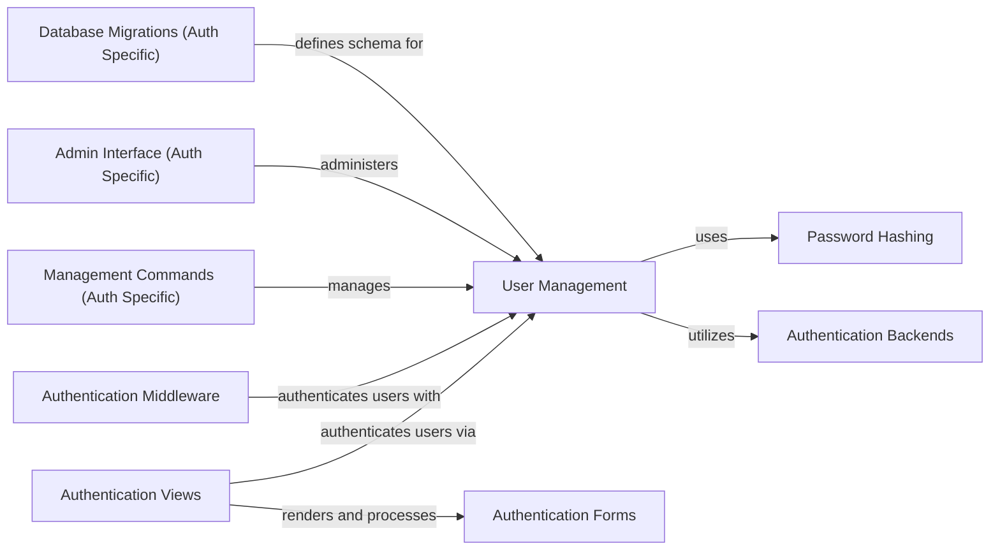

## Component Details

The Authentication & Security subsystem in Django is responsible for managing user identities, controlling access to resources, and ensuring the secure handling of sensitive user data like passwords. It encompasses user models, authentication mechanisms, authorization checks, password hashing, and related administrative functionalities, providing a robust framework for securing web applications.

### User Management
This component is responsible for managing user accounts, including creation, authentication, password handling, and permission checks. It provides the underlying logic for user-related operations within Django.

**Related Classes/Methods**:

- <a href="https://github.com/django/django/blob/master/django/contrib/auth/models.py#L140-L239" target="_blank" rel="noopener noreferrer">`django.contrib.auth.models.UserManager` (140:239)</a>
- <a href="https://github.com/django/django/blob/master/django/contrib/auth/models.py#L317-L443" target="_blank" rel="noopener noreferrer">`django.contrib.auth.models.PermissionsMixin` (317:443)</a>
- <a href="https://github.com/django/django/blob/master/django/contrib/auth/models.py#L446-L514" target="_blank" rel="noopener noreferrer">`django.contrib.auth.models.AbstractUser` (446:514)</a>
- <a href="https://github.com/django/django/blob/master/django/contrib/auth/models.py#L529-L634" target="_blank" rel="noopener noreferrer">`django.contrib.auth.models.AnonymousUser` (529:634)</a>
- <a href="https://github.com/django/django/blob/master/django/contrib/auth/base_user.py#L43-L164" target="_blank" rel="noopener noreferrer">`django.contrib.auth.base_user.AbstractBaseUser` (43:164)</a>
- <a href="https://github.com/django/django/blob/master/django/contrib/auth/models.py#L102-L137" target="_blank" rel="noopener noreferrer">`django.contrib.auth.models.Group` (102:137)</a>
- <a href="https://github.com/django/django/blob/master/django/contrib/auth/models.py#L39-L85" target="_blank" rel="noopener noreferrer">`django.contrib.auth.models.Permission` (39:85)</a>
- <a href="https://github.com/django/django/blob/master/django/contrib/auth/models.py#L88-L99" target="_blank" rel="noopener noreferrer">`django.contrib.auth.models.GroupManager` (88:99)</a>
- <a href="https://github.com/django/django/blob/master/django/contrib/auth/models.py#L27-L36" target="_blank" rel="noopener noreferrer">`django.contrib.auth.models.PermissionManager` (27:36)</a>
- <a href="https://github.com/django/django/blob/master/django/contrib/auth/management/commands/createsuperuser.py#L26-L317" target="_blank" rel="noopener noreferrer">`django.contrib.auth.management.commands.createsuperuser.Command` (26:317)</a>

### Authentication Views
This component provides the views and logic for user authentication processes such as login, logout, password reset, and password change. It handles user input, validates credentials, and manages user sessions.

**Related Classes/Methods**:

- <a href="https://github.com/django/django/blob/master/django/contrib/auth/views.py#L35-L62" target="_blank" rel="noopener noreferrer">`django.contrib.auth.views.RedirectURLMixin` (35:62)</a>
- <a href="https://github.com/django/django/blob/master/django/contrib/auth/views.py#L66-L122" target="_blank" rel="noopener noreferrer">`django.contrib.auth.views.LoginView` (66:122)</a>
- <a href="https://github.com/django/django/blob/master/django/contrib/auth/views.py#L125-L169" target="_blank" rel="noopener noreferrer">`django.contrib.auth.views.LogoutView` (125:169)</a>
- <a href="https://github.com/django/django/blob/master/django/contrib/auth/views.py#L256-L340" target="_blank" rel="noopener noreferrer">`django.contrib.auth.views.PasswordResetConfirmView` (256:340)</a>
- <a href="https://github.com/django/django/blob/master/django/contrib/auth/views.py#L344-L351" target="_blank" rel="noopener noreferrer">`django.contrib.auth.views.PasswordResetCompleteView` (344:351)</a>
- <a href="https://github.com/django/django/blob/master/django/contrib/auth/views.py#L354-L376" target="_blank" rel="noopener noreferrer">`django.contrib.auth.views.PasswordChangeView` (354:376)</a>
- <a href="https://github.com/django/django/blob/master/django/contrib/auth/views.py#L215-L243" target="_blank" rel="noopener noreferrer">`django.contrib.auth.views.PasswordResetView` (215:243)</a>
- <a href="https://github.com/django/django/blob/master/django/contrib/auth/views.py#L379-L385" target="_blank" rel="noopener noreferrer">`django.contrib.auth.views.PasswordChangeDoneView` (379:385)</a>
- <a href="https://github.com/django/django/blob/master/django/contrib/auth/views.py#L250-L252" target="_blank" rel="noopener noreferrer">`django.contrib.auth.views.PasswordResetDoneView` (250:252)</a>

### Password Hashing
This component provides various password hashing algorithms and utilities for securely storing and verifying user passwords. It includes functions for creating, checking, and identifying password hashes.

**Related Classes/Methods**:

- <a href="https://github.com/django/django/blob/master/django/contrib/auth/hashers.py#L94-L113" target="_blank" rel="noopener noreferrer">`django.contrib.auth.hashers.make_password` (94:113)</a>
- <a href="https://github.com/django/django/blob/master/django/contrib/auth/hashers.py#L36-L69" target="_blank" rel="noopener noreferrer">`django.contrib.auth.hashers.verify_password` (36:69)</a>
- <a href="https://github.com/django/django/blob/master/django/contrib/auth/hashers.py#L72-L83" target="_blank" rel="noopener noreferrer">`django.contrib.auth.hashers.check_password` (72:83)</a>
- <a href="https://github.com/django/django/blob/master/django/contrib/auth/hashers.py#L142-L164" target="_blank" rel="noopener noreferrer">`django.contrib.auth.hashers.get_hasher` (142:164)</a>
- <a href="https://github.com/django/django/blob/master/django/contrib/auth/hashers.py#L167-L186" target="_blank" rel="noopener noreferrer">`django.contrib.auth.hashers.identify_hasher` (167:186)</a>
- <a href="https://github.com/django/django/blob/master/django/contrib/auth/hashers.py#L204-L308" target="_blank" rel="noopener noreferrer">`django.contrib.auth.hashers.BasePasswordHasher` (204:308)</a>
- <a href="https://github.com/django/django/blob/master/django/contrib/auth/hashers.py#L311-L364" target="_blank" rel="noopener noreferrer">`django.contrib.auth.hashers.PBKDF2PasswordHasher` (311:364)</a>
- <a href="https://github.com/django/django/blob/master/django/contrib/auth/hashers.py#L379-L478" target="_blank" rel="noopener noreferrer">`django.contrib.auth.hashers.Argon2PasswordHasher` (379:478)</a>
- <a href="https://github.com/django/django/blob/master/django/contrib/auth/hashers.py#L481-L550" target="_blank" rel="noopener noreferrer">`django.contrib.auth.hashers.BCryptSHA256PasswordHasher` (481:550)</a>
- <a href="https://github.com/django/django/blob/master/django/contrib/auth/hashers.py#L571-L646" target="_blank" rel="noopener noreferrer">`django.contrib.auth.hashers.ScryptPasswordHasher` (571:646)</a>
- <a href="https://github.com/django/django/blob/master/django/contrib/auth/hashers.py#L649-L688" target="_blank" rel="noopener noreferrer">`django.contrib.auth.hashers.MD5PasswordHasher` (649:688)</a>
- <a href="https://github.com/django/django/blob/master/django/contrib/auth/hashers.py#L367-L376" target="_blank" rel="noopener noreferrer">`django.contrib.auth.hashers.PBKDF2SHA1PasswordHasher` (367:376)</a>
- <a href="https://github.com/django/django/blob/master/django/contrib/auth/hashers.py#L553-L568" target="_blank" rel="noopener noreferrer">`django.contrib.auth.hashers.BCryptPasswordHasher` (553:568)</a>

### Authentication Middleware
This component provides middleware classes that integrate authentication functionalities into the request-response cycle. It handles user session management, login requirements, and remote user authentication.

**Related Classes/Methods**:

- <a href="https://github.com/django/django/blob/master/django/contrib/auth/middleware.py#L30-L41" target="_blank" rel="noopener noreferrer">`django.contrib.auth.middleware.AuthenticationMiddleware` (30:41)</a>
- <a href="https://github.com/django/django/blob/master/django/contrib/auth/middleware.py#L44-L91" target="_blank" rel="noopener noreferrer">`django.contrib.auth.middleware.LoginRequiredMiddleware` (44:91)</a>
- <a href="https://github.com/django/django/blob/master/django/contrib/auth/middleware.py#L94-L277" target="_blank" rel="noopener noreferrer">`django.contrib.auth.middleware.RemoteUserMiddleware` (94:277)</a>
- <a href="https://github.com/django/django/blob/master/django/contrib/auth/middleware.py#L280-L291" target="_blank" rel="noopener noreferrer">`django.contrib.auth.middleware.PersistentRemoteUserMiddleware` (280:291)</a>

### Authentication Forms
This component defines the forms used for user authentication, registration, and password management. It includes forms for login, password reset, password change, and user creation, with built-in validation.

**Related Classes/Methods**:

- <a href="https://github.com/django/django/blob/master/django/contrib/auth/forms.py#L79-L135" target="_blank" rel="noopener noreferrer">`django.contrib.auth.forms.SetPasswordMixin` (79:135)</a>
- <a href="https://github.com/django/django/blob/master/django/contrib/auth/forms.py#L138-L207" target="_blank" rel="noopener noreferrer">`django.contrib.auth.forms.SetUnusablePasswordMixin` (138:207)</a>
- <a href="https://github.com/django/django/blob/master/django/contrib/auth/forms.py#L210-L248" target="_blank" rel="noopener noreferrer">`django.contrib.auth.forms.BaseUserCreationForm` (210:248)</a>
- <a href="https://github.com/django/django/blob/master/django/contrib/auth/forms.py#L302-L381" target="_blank" rel="noopener noreferrer">`django.contrib.auth.forms.AuthenticationForm` (302:381)</a>
- <a href="https://github.com/django/django/blob/master/django/contrib/auth/forms.py#L384-L485" target="_blank" rel="noopener noreferrer">`django.contrib.auth.forms.PasswordResetForm` (384:485)</a>
- <a href="https://github.com/django/django/blob/master/django/contrib/auth/forms.py#L488-L508" target="_blank" rel="noopener noreferrer">`django.contrib.auth.forms.SetPasswordForm` (488:508)</a>
- <a href="https://github.com/django/django/blob/master/django/contrib/auth/forms.py#L511-L544" target="_blank" rel="noopener noreferrer">`django.contrib.auth.forms.PasswordChangeForm` (511:544)</a>
- <a href="https://github.com/django/django/blob/master/django/contrib/admin/forms.py#L30-L31" target="_blank" rel="noopener noreferrer">`django.contrib.admin.forms.AdminPasswordChangeForm` (30:31)</a>
- <a href="https://github.com/django/django/blob/master/django/contrib/auth/forms.py#L251-L269" target="_blank" rel="noopener noreferrer">`django.contrib.auth.forms.UserCreationForm` (251:269)</a>
- <a href="https://github.com/django/django/blob/master/django/contrib/auth/forms.py#L272-L299" target="_blank" rel="noopener noreferrer">`django.contrib.auth.forms.UserChangeForm` (272:299)</a>
- <a href="https://github.com/django/django/blob/master/django/contrib/auth/forms.py#L589-L596" target="_blank" rel="noopener noreferrer">`django.contrib.auth.forms.AdminUserCreationForm` (589:596)</a>
- <a href="https://github.com/django/django/blob/master/django/contrib/auth/forms.py#L50-L56" target="_blank" rel="noopener noreferrer">`django.contrib.auth.forms.ReadOnlyPasswordHashField` (50:56)</a>
- <a href="https://github.com/django/django/blob/master/django/contrib/auth/forms.py#L35-L47" target="_blank" rel="noopener noreferrer">`django.contrib.auth.forms.ReadOnlyPasswordHashWidget` (35:47)</a>
- <a href="https://github.com/django/django/blob/master/django/contrib/auth/forms.py#L59-L76" target="_blank" rel="noopener noreferrer">`django.contrib.auth.forms.UsernameField` (59:76)</a>

### Authentication Backends
This component provides different authentication backends that define how users are authenticated and how their permissions are retrieved. It includes a model-based backend and a remote user backend.

**Related Classes/Methods**:

- <a href="https://github.com/django/django/blob/master/django/contrib/auth/backends.py#L10-L51" target="_blank" rel="noopener noreferrer">`django.contrib.auth.backends.BaseBackend` (10:51)</a>
- <a href="https://github.com/django/django/blob/master/django/contrib/auth/backends.py#L54-L242" target="_blank" rel="noopener noreferrer">`django.contrib.auth.backends.ModelBackend` (54:242)</a>
- <a href="https://github.com/django/django/blob/master/django/contrib/auth/backends.py#L250-L337" target="_blank" rel="noopener noreferrer">`django.contrib.auth.backends.RemoteUserBackend` (250:337)</a>
- <a href="https://github.com/django/django/blob/master/django/contrib/auth/backends.py#L245-L247" target="_blank" rel="noopener noreferrer">`django.contrib.auth.backends.AllowAllUsersModelBackend` (245:247)</a>
- <a href="https://github.com/django/django/blob/master/django/contrib/auth/backends.py#L340-L342" target="_blank" rel="noopener noreferrer">`django.contrib.auth.backends.AllowAllUsersRemoteUserBackend` (340:342)</a>

### Database Migrations (Auth Specific)
This component is responsible for managing database schema changes for authentication-related models through migrations. It includes the specific migration files that define the database structure for users, groups, and permissions.

**Related Classes/Methods**:

- <a href="https://github.com/django/django/blob/master/django/contrib/auth/migrations/0001_initial.py#L7-L204" target="_blank" rel="noopener noreferrer">`django.contrib.auth.migrations.0001_initial.Migration` (7:204)</a>
- <a href="https://github.com/django/django/blob/master/django/contrib/auth/migrations/0002_alter_permission_name_max_length.py#L4-L15" target="_blank" rel="noopener noreferrer">`django.contrib.auth.migrations.0002_alter_permission_name_max_length.Migration` (4:15)</a>
- <a href="https://github.com/django/django/blob/master/django/contrib/auth/migrations/0003_alter_user_email_max_length.py#L4-L17" target="_blank" rel="noopener noreferrer">`django.contrib.auth.migrations.0003_alter_user_email_max_length.Migration` (4:17)</a>
- <a href="https://github.com/django/django/blob/master/django/contrib/auth/migrations/0004_alter_user_username_opts.py#L5-L27" target="_blank" rel="noopener noreferrer">`django.contrib.auth.migrations.0004_alter_user_username_opts.Migration` (5:27)</a>
- <a href="https://github.com/django/django/blob/master/django/contrib/auth/migrations/0005_alter_user_last_login_null.py#L4-L17" target="_blank" rel="noopener noreferrer">`django.contrib.auth.migrations.0005_alter_user_last_login_null.Migration` (4:17)</a>
- <a href="https://github.com/django/django/blob/master/django/contrib/auth/migrations/0006_require_contenttypes_0002.py#L4-L13" target="_blank" rel="noopener noreferrer">`django.contrib.auth.migrations.0006_require_contenttypes_0002.Migration` (4:13)</a>
- <a href="https://github.com/django/django/blob/master/django/contrib/auth/migrations/0007_alter_validators_add_error_messages.py#L5-L26" target="_blank" rel="noopener noreferrer">`django.contrib.auth.migrations.0007_alter_validators_add_error_messages.Migration` (5:26)</a>
- <a href="https://github.com/django/django/blob/master/django/contrib/auth/migrations/0008_alter_user_username_max_length.py#L5-L26" target="_blank" rel="noopener noreferrer">`django.contrib.auth.migrations.0008_alter_user_username_max_length.Migration` (5:26)</a>
- <a href="https://github.com/django/django/blob/master/django/contrib/auth/migrations/0009_alter_user_last_name_max_length.py#L4-L17" target="_blank" rel="noopener noreferrer">`django.contrib.auth.migrations.0009_alter_user_last_name_max_length.Migration` (4:17)</a>
- <a href="https://github.com/django/django/blob/master/django/contrib/auth/migrations/0010_alter_group_name_max_length.py#L4-L15" target="_blank" rel="noopener noreferrer">`django.contrib.auth.migrations.0010_alter_group_name_max_length.Migration` (4:15)</a>
- <a href="https://github.com/django/django/blob/master/django/contrib/auth/migrations/0011_update_proxy_permissions.py#L67-L76" target="_blank" rel="noopener noreferrer">`django.contrib.auth.migrations.0011_update_proxy_permissions.Migration` (67:76)</a>
- <a href="https://github.com/django/django/blob/master/django/contrib/auth/migrations/0012_alter_user_first_name_max_length.py#L4-L17" target="_blank" rel="noopener noreferrer">`django.contrib.auth.migrations.0012_alter_user_first_name_max_length.Migration` (4:17)</a>

### Management Commands (Auth Specific)
This component provides specific management commands for interacting with the Django authentication system, such as creating superusers and changing user passwords.

**Related Classes/Methods**:

- <a href="https://github.com/django/django/blob/master/django/contrib/auth/management/commands/createsuperuser.py#L26-L317" target="_blank" rel="noopener noreferrer">`django.contrib.auth.management.commands.createsuperuser.Command` (26:317)</a>
- <a href="https://github.com/django/django/blob/master/django/contrib/auth/management/commands/changepassword.py#L12-L82" target="_blank" rel="noopener noreferrer">`django.contrib.auth.management.commands.changepassword.Command` (12:82)</a>

### Admin Interface (Auth Specific)
This component handles the integration of authentication and authorization models into the Django administration interface, allowing administrators to manage users, groups, and permissions.

**Related Classes/Methods**:

- <a href="https://github.com/django/django/blob/master/django/contrib/admin/forms.py#L6-L27" target="_blank" rel="noopener noreferrer">`django.contrib.admin.forms.AdminAuthenticationForm` (6:27)</a>
- <a href="https://github.com/django/django/blob/master/django/contrib/admin/forms.py#L30-L31" target="_blank" rel="noopener noreferrer">`django.contrib.admin.forms.AdminPasswordChangeForm` (30:31)</a>
- <a href="https://github.com/django/django/blob/master/django/contrib/auth/admin.py#L29-L40" target="_blank" rel="noopener noreferrer">`django.contrib.auth.admin.GroupAdmin` (29:40)</a>
- <a href="https://github.com/django/django/blob/master/django/contrib/auth/admin.py#L44-L255" target="_blank" rel="noopener noreferrer">`django.contrib.auth.admin.UserAdmin` (44:255)</a>

### [FAQ](https://github.com/CodeBoarding/GeneratedOnBoardings/tree/main?tab=readme-ov-file#faq)