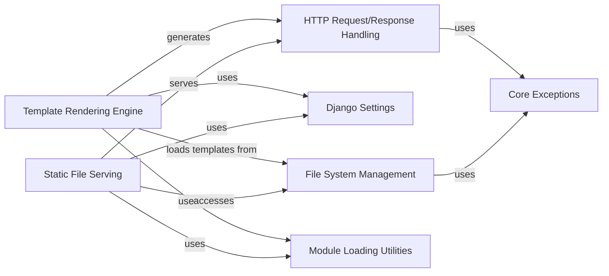

## Component Details

Manages the serving of static files (CSS, JavaScript, images) and the rendering of dynamic content using Django's templating engine. This involves processing HTTP requests, loading configuration from Django settings, interacting with the file system for assets and templates, and dynamically loading necessary modules.

### Template Rendering Engine
Manages the parsing, compilation, and rendering of dynamic content using Django's templating system. It handles template loading, context management, and the execution of template tags and filters to produce HTML or other text-based output.

**Related Classes/Methods**:

- <a href="https://github.com/django/django/blob/master/django/template/base.py#L165-L173" target="_blank" rel="noopener noreferrer">`django.template.base.Template:render` (165:173)</a>
- `django.template.base.NodeList` (full file reference)
- <a href="https://github.com/django/django/blob/master/django/template/base.py#L790-L960" target="_blank" rel="noopener noreferrer">`django.template.base.Variable` (790:960)</a>
- <a href="https://github.com/django/django/blob/master/django/template/base.py#L663-L787" target="_blank" rel="noopener noreferrer">`django.template.base.FilterExpression` (663:787)</a>
- <a href="https://github.com/django/django/blob/master/django/template/engine.py#L13-L214" target="_blank" rel="noopener noreferrer">`django.template.engine.Engine` (13:214)</a>
- <a href="https://github.com/django/django/blob/master/django/template/backends/django.py#L16-L90" target="_blank" rel="noopener noreferrer">`django.template.backends.django.DjangoTemplates` (16:90)</a>
- <a href="https://github.com/django/django/blob/master/django/template/context.py#L138-L173" target="_blank" rel="noopener noreferrer">`django.template.context.Context` (138:173)</a>
- <a href="https://github.com/django/django/blob/master/django/template/context.py#L176-L217" target="_blank" rel="noopener noreferrer">`django.template.context.RenderContext` (176:217)</a>
- <a href="https://github.com/django/django/blob/master/django/template/context.py#L220-L283" target="_blank" rel="noopener noreferrer">`django.template.context.RequestContext` (220:283)</a>
- `django.template.loader` (full file reference)
- <a href="https://github.com/django/django/blob/master/django/template/exceptions.py#L39-L44" target="_blank" rel="noopener noreferrer">`django.template.exceptions.TemplateSyntaxError` (39:44)</a>
- `django.template.library` (full file reference)
- `django.template.defaulttags` (full file reference)
- `django.template.defaultfilters` (full file reference)
- <a href="https://github.com/django/django/blob/master/django/template/loaders/app_directories.py#L11-L13" target="_blank" rel="noopener noreferrer">`django.template.loaders.app_directories.Loader` (11:13)</a>
- <a href="https://github.com/django/django/blob/master/django/template/loaders/filesystem.py#L12-L45" target="_blank" rel="noopener noreferrer">`django.template.loaders.filesystem.Loader` (12:45)</a>
- <a href="https://github.com/django/django/blob/master/django/template/loaders/cached.py#L14-L100" target="_blank" rel="noopener noreferrer">`django.template.loaders.cached.Loader` (14:100)</a>
- <a href="https://github.com/django/django/blob/master/django/template/response.py#L147-L164" target="_blank" rel="noopener noreferrer">`django.template.response.TemplateResponse` (147:164)</a>
- <a href="https://github.com/django/django/blob/master/django/template/response.py#L10-L144" target="_blank" rel="noopener noreferrer">`django.template.response.SimpleTemplateResponse` (10:144)</a>

### Static File Serving
Provides mechanisms for locating, collecting, and serving static assets like CSS, JavaScript, and images. It handles the mapping of URLs to physical file paths and ensures efficient delivery of these files to the client.

**Related Classes/Methods**:

- <a href="https://github.com/django/django/blob/master/django/contrib/staticfiles/views.py#L16-L40" target="_blank" rel="noopener noreferrer">`django.contrib.staticfiles.views:serve` (16:40)</a>
- `django.contrib.staticfiles.finders` (full file reference)
- `django.contrib.staticfiles.storage` (full file reference)
- `django.contrib.staticfiles.urls` (full file reference)
- <a href="https://github.com/django/django/blob/master/django/contrib/staticfiles/apps.py#L7-L14" target="_blank" rel="noopener noreferrer">`django.contrib.staticfiles.apps.StaticFilesConfig` (7:14)</a>
- <a href="https://github.com/django/django/blob/master/django/core/files/storage/filesystem.py#L19-L228" target="_blank" rel="noopener noreferrer">`django.core.files.storage.filesystem.FileSystemStorage` (19:228)</a>
- `django.core.files.storage.DefaultStorage` (full file reference)
- <a href="https://github.com/django/django/blob/master/django/http/response.py#L365-L435" target="_blank" rel="noopener noreferrer">`django.http.response.HttpResponse` (365:435)</a>
- <a href="https://github.com/django/django/blob/master/django/contrib/staticfiles/handlers.py#L67-L81" target="_blank" rel="noopener noreferrer">`django.contrib.staticfiles.handlers.StaticFilesHandler` (67:81)</a>
- <a href="https://github.com/django/django/blob/master/django/contrib/staticfiles/management/commands/collectstatic.py#L13-L379" target="_blank" rel="noopener noreferrer">`django.contrib.staticfiles.management.commands.collectstatic.Command` (13:379)</a>
- <a href="https://github.com/django/django/blob/master/django/contrib/staticfiles/management/commands/findstatic.py#L7-L48" target="_blank" rel="noopener noreferrer">`django.contrib.staticfiles.management.commands.findstatic.Command` (7:48)</a>
- <a href="https://github.com/django/django/blob/master/django/contrib/staticfiles/management/commands/runserver.py#L6-L36" target="_blank" rel="noopener noreferrer">`django.contrib.staticfiles.management.commands.runserver.Command` (6:36)</a>
- <a href="https://github.com/django/django/blob/master/django/templatetags/static.py#L95-L152" target="_blank" rel="noopener noreferrer">`django.templatetags.static.StaticNode` (95:152)</a>

### HTTP Request/Response Handling
Handles incoming HTTP requests and generates outgoing HTTP responses. This component is fundamental for any web application, processing request data and formatting responses, including serving static files and rendered templates.

**Related Classes/Methods**:

- <a href="https://github.com/django/django/blob/master/django/http/request.py#L53-L470" target="_blank" rel="noopener noreferrer">`django.http.request.HttpRequest` (53:470)</a>
- <a href="https://github.com/django/django/blob/master/django/http/response.py#L365-L435" target="_blank" rel="noopener noreferrer">`django.http.response.HttpResponse` (365:435)</a>
- <a href="https://github.com/django/django/blob/master/django/core/handlers/wsgi.py#L113-L144" target="_blank" rel="noopener noreferrer">`django.core.handlers.wsgi.WSGIHandler` (113:144)</a>
- <a href="https://github.com/django/django/blob/master/django/core/handlers/asgi.py#L139-L381" target="_blank" rel="noopener noreferrer">`django.core.handlers.asgi.ASGIHandler` (139:381)</a>
- <a href="https://github.com/django/django/blob/master/django/views/generic/base.py#L37-L181" target="_blank" rel="noopener noreferrer">`django.views.generic.base.View` (37:181)</a>
- <a href="https://github.com/django/django/blob/master/django/http/response.py#L545-L624" target="_blank" rel="noopener noreferrer">`django.http.response.FileResponse` (545:624)</a>
- <a href="https://github.com/django/django/blob/master/django/http/response.py#L438-L542" target="_blank" rel="noopener noreferrer">`django.http.response.StreamingHttpResponse` (438:542)</a>
- <a href="https://github.com/django/django/blob/master/django/http/response.py#L721-L752" target="_blank" rel="noopener noreferrer">`django.http.response.JsonResponse` (721:752)</a>
- <a href="https://github.com/django/django/blob/master/django/http/response.py#L681-L682" target="_blank" rel="noopener noreferrer">`django.http.response.HttpResponseBadRequest` (681:682)</a>
- <a href="https://github.com/django/django/blob/master/django/http/response.py#L689-L690" target="_blank" rel="noopener noreferrer">`django.http.response.HttpResponseForbidden` (689:690)</a>
- <a href="https://github.com/django/django/blob/master/django/http/response.py#L709-L710" target="_blank" rel="noopener noreferrer">`django.http.response.HttpResponseGone` (709:710)</a>
- <a href="https://github.com/django/django/blob/master/django/http/response.py#L693-L706" target="_blank" rel="noopener noreferrer">`django.http.response.HttpResponseNotAllowed` (693:706)</a>
- <a href="https://github.com/django/django/blob/master/django/http/response.py#L685-L686" target="_blank" rel="noopener noreferrer">`django.http.response.HttpResponseNotFound` (685:686)</a>
- <a href="https://github.com/django/django/blob/master/django/http/response.py#L665-L678" target="_blank" rel="noopener noreferrer">`django.http.response.HttpResponseNotModified` (665:678)</a>
- <a href="https://github.com/django/django/blob/master/django/http/response.py#L660-L662" target="_blank" rel="noopener noreferrer">`django.http.response.HttpResponsePermanentRedirect` (660:662)</a>
- <a href="https://github.com/django/django/blob/master/django/http/response.py#L655-L657" target="_blank" rel="noopener noreferrer">`django.http.response.HttpResponseRedirect` (655:657)</a>
- <a href="https://github.com/django/django/blob/master/django/http/response.py#L713-L714" target="_blank" rel="noopener noreferrer">`django.http.response.HttpResponseServerError` (713:714)</a>
- <a href="https://github.com/django/django/blob/master/django/http/request.py#L524-L692" target="_blank" rel="noopener noreferrer">`django.http.request.QueryDict` (524:692)</a>
- <a href="https://github.com/django/django/blob/master/django/http/request.py#L473-L521" target="_blank" rel="noopener noreferrer">`django.http.request.HttpHeaders` (473:521)</a>
- `django.http.multipartparser` (full file reference)

### Django Settings
Manages the global settings for a Django project. It provides access to configuration variables that influence the behavior of Django applications, such as `INSTALLED_APPS`, `TEMPLATES`, `STATIC_URL`, `STATIC_ROOT`, `STATICFILES_DIRS`.

**Related Classes/Methods**:

- `django.conf.settings` (full file reference)
- `django.conf.LazySettings` (full file reference)
- `django.conf.UserSettingsHolder` (full file reference)

### File System Management
Provides utilities for interacting with the file system, including file storage, handling uploaded files, and managing temporary files. This is crucial for static file serving and potentially for template loading if templates are stored on the file system.

**Related Classes/Methods**:

- <a href="https://github.com/django/django/blob/master/django/core/files/storage/filesystem.py#L19-L228" target="_blank" rel="noopener noreferrer">`django.core.files.storage.filesystem.FileSystemStorage` (19:228)</a>
- <a href="https://github.com/django/django/blob/master/django/core/files/base.py#L8-L118" target="_blank" rel="noopener noreferrer">`django.core.files.base.File` (8:118)</a>
- <a href="https://github.com/django/django/blob/master/django/core/files/uploadedfile.py#L21-L67" target="_blank" rel="noopener noreferrer">`django.core.files.uploadedfile.UploadedFile` (21:67)</a>
- <a href="https://github.com/django/django/blob/master/django/core/files/uploadhandler.py#L69-L158" target="_blank" rel="noopener noreferrer">`django.core.files.uploadhandler.FileUploadHandler` (69:158)</a>
- `django.utils._os` (full file reference)
- <a href="https://github.com/django/django/blob/master/django/core/files/storage/base.py#L11-L206" target="_blank" rel="noopener noreferrer">`django.core.files.storage.base.Storage` (11:206)</a>
- <a href="https://github.com/django/django/blob/master/django/core/files/storage/memory.py#L168-L293" target="_blank" rel="noopener noreferrer">`django.core.files.storage.memory.InMemoryStorage` (168:293)</a>
- <a href="https://github.com/django/django/blob/master/django/core/files/images.py#L13-L32" target="_blank" rel="noopener noreferrer">`django.core.files.images.ImageFile` (13:32)</a>
- `django.core.files.move` (full file reference)
- `django.core.files.locks` (full file reference)
- `django.core.files.temp` (full file reference)

### Module Loading Utilities
Provides utility functions for dynamically loading Python modules and objects from string paths. This is crucial for Django's pluggable application architecture, including loading template engines and static file finders.

**Related Classes/Methods**:

- <a href="https://github.com/django/django/blob/master/django/utils/module_loading.py#L19-L35" target="_blank" rel="noopener noreferrer">`django.utils.module_loading.import_string` (19:35)</a>
- <a href="https://github.com/django/django/blob/master/django/utils/module_loading.py#L74-L89" target="_blank" rel="noopener noreferrer">`django.utils.module_loading.module_has_submodule` (74:89)</a>

### Core Exceptions
Provides various exception classes used throughout Django to signal errors and exceptional conditions. These exceptions help in handling and propagating errors in a structured manner.

**Related Classes/Methods**:

- <a href="https://github.com/django/django/blob/master/django/core/exceptions.py#L16-L19" target="_blank" rel="noopener noreferrer">`django.core.exceptions.AppRegistryNotReady` (16:19)</a>
- <a href="https://github.com/django/django/blob/master/django/core/exceptions.py#L123-L126" target="_blank" rel="noopener noreferrer">`django.core.exceptions.ImproperlyConfigured` (123:126)</a>
- <a href="https://github.com/django/django/blob/master/django/core/exceptions.py#L38-L39" target="_blank" rel="noopener noreferrer">`django.core.exceptions.SuspiciousOperation` (38:39)</a>
- <a href="https://github.com/django/django/blob/master/django/core/exceptions.py#L99-L102" target="_blank" rel="noopener noreferrer">`django.core.exceptions.BadRequest` (99:102)</a>
- <a href="https://github.com/django/django/blob/master/django/core/exceptions.py#L22-L25" target="_blank" rel="noopener noreferrer">`django.core.exceptions.ObjectDoesNotExist` (22:25)</a>
- <a href="https://github.com/django/django/blob/master/django/core/exceptions.py#L129-L132" target="_blank" rel="noopener noreferrer">`django.core.exceptions.FieldError` (129:132)</a>
- <a href="https://github.com/django/django/blob/master/django/db/utils.py#L25-L26" target="_blank" rel="noopener noreferrer">`django.db.utils.DatabaseError` (25:26)</a>
- <a href="https://github.com/django/django/blob/master/django/db/utils.py#L37-L38" target="_blank" rel="noopener noreferrer">`django.db.utils.IntegrityError` (37:38)</a>
- <a href="https://github.com/django/django/blob/master/django/db/utils.py#L21-L22" target="_blank" rel="noopener noreferrer">`django.db.utils.InterfaceError` (21:22)</a>
- <a href="https://github.com/django/django/blob/master/django/db/utils.py#L41-L42" target="_blank" rel="noopener noreferrer">`django.db.utils.InternalError` (41:42)</a>
- <a href="https://github.com/django/django/blob/master/django/db/utils.py#L49-L50" target="_blank" rel="noopener noreferrer">`django.db.utils.NotSupportedError` (49:50)</a>
- <a href="https://github.com/django/django/blob/master/django/db/utils.py#L33-L34" target="_blank" rel="noopener noreferrer">`django.db.utils.OperationalError` (33:34)</a>
- <a href="https://github.com/django/django/blob/master/django/db/utils.py#L45-L46" target="_blank" rel="noopener noreferrer">`django.db.utils.ProgrammingError` (45:46)</a>
- <a href="https://github.com/django/django/blob/master/django/urls/exceptions.py#L4-L5" target="_blank" rel="noopener noreferrer">`django.urls.exceptions.Resolver404` (4:5)</a>
- <a href="https://github.com/django/django/blob/master/django/http/response.py#L717-L718" target="_blank" rel="noopener noreferrer">`django.http.response.Http404` (717:718)</a>

### [FAQ](https://github.com/CodeBoarding/GeneratedOnBoardings/tree/main?tab=readme-ov-file#faq)