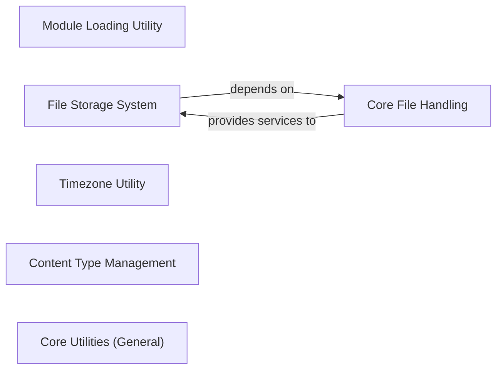

## Component Details

This graph represents the 'Core Utilities & File Handling' subsystem of Django, which provides foundational functionalities across various Django components. The main flow involves utilities for dynamic module loading, robust file storage and handling, precise timezone management, efficient content type lookups, and a wide array of general-purpose utilities including cryptographic operations, data structures, and text manipulation. Its purpose is to offer a comprehensive set of reusable tools and abstractions that underpin much of Django's core operations, ensuring consistency, efficiency, and extensibility in areas like file management, data representation, and system-wide configurations.

### Module Loading Utility
Provides functions for dynamically importing Python modules and classes, often with a caching mechanism to improve performance for repeated imports.

**Related Classes/Methods**:

- <a href="https://github.com/django/django/blob/master/django/utils/module_loading.py#L19-L35" target="_blank" rel="noopener noreferrer">`django.utils.module_loading:import_string` (19:35)</a>
- <a href="https://github.com/django/django/blob/master/django/utils/module_loading.py#L8-L16" target="_blank" rel="noopener noreferrer">`django.utils.module_loading:cached_import` (8:16)</a>

### File Storage System
Defines the interface and provides implementations for Django's file storage systems, including base classes for custom storage, filesystem storage, and in-memory storage. It handles saving, deleting, and managing files.

**Related Classes/Methods**:

- <a href="https://github.com/django/django/blob/master/django/core/files/storage/base.py#L24-L52" target="_blank" rel="noopener noreferrer">`django.core.files.storage.base.Storage:save` (24:52)</a>
- <a href="https://github.com/django/django/blob/master/django/core/files/storage/base.py#L75-L115" target="_blank" rel="noopener noreferrer">`django.core.files.storage.base.Storage.get_available_name` (75:115)</a>
- <a href="https://github.com/django/django/blob/master/django/core/files/storage/base.py#L11-L206" target="_blank" rel="noopener noreferrer">`django.core.files.storage.base.Storage` (11:206)</a>
- <a href="https://github.com/django/django/blob/master/django/core/files/storage/filesystem.py#L19-L228" target="_blank" rel="noopener noreferrer">`django.core.files.storage.filesystem.FileSystemStorage` (19:228)</a>
- <a href="https://github.com/django/django/blob/master/django/core/files/storage/memory.py#L168-L293" target="_blank" rel="noopener noreferrer">`django.core.files.storage.memory.InMemoryStorage` (168:293)</a>
- <a href="https://github.com/django/django/blob/master/django/core/files/storage/handler.py#L11-L46" target="_blank" rel="noopener noreferrer">`django.core.files.storage.handler.StorageHandler` (11:46)</a>

### Core File Handling
Encapsulates the basic representation and manipulation of files within Django, including file object creation (File, ContentFile) and utility functions for file name validation.

**Related Classes/Methods**:

- <a href="https://github.com/django/django/blob/master/django/core/files/base.py#L8-L118" target="_blank" rel="noopener noreferrer">`django.core.files.base.File` (8:118)</a>
- <a href="https://github.com/django/django/blob/master/django/core/files/base.py#L121-L146" target="_blank" rel="noopener noreferrer">`django.core.files.base.ContentFile` (121:146)</a>
- <a href="https://github.com/django/django/blob/master/django/core/files/utils.py#L7-L23" target="_blank" rel="noopener noreferrer">`django.core.files.utils.validate_file_name` (7:23)</a>
- <a href="https://github.com/django/django/blob/master/django/core/files/utils.py#L26-L77" target="_blank" rel="noopener noreferrer">`django.core.files.utils.FileProxyMixin` (26:77)</a>
- `django.core.files.images` (full file reference)
- `django.core.files.move` (full file reference)
- `django.core.files.temp` (full file reference)
- `django.core.files.uploadedfile` (full file reference)
- `django.core.files.uploadhandler` (full file reference)

### Timezone Utility
Offers functions for managing and converting datetime objects with respect to timezones, including obtaining the current time and handling timezone awareness.

**Related Classes/Methods**:

- <a href="https://github.com/django/django/blob/master/django/utils/timezone.py#L200-L204" target="_blank" rel="noopener noreferrer">`django.utils.timezone:now` (200:204)</a>
- <a href="https://github.com/django/django/blob/master/django/utils/timezone.py#L167-L184" target="_blank" rel="noopener noreferrer">`django.utils.timezone:localtime` (167:184)</a>
- <a href="https://github.com/django/django/blob/master/django/utils/timezone.py#L211-L221" target="_blank" rel="noopener noreferrer">`django.utils.timezone:is_aware` (211:221)</a>
- <a href="https://github.com/django/django/blob/master/django/utils/timezone.py#L224-L234" target="_blank" rel="noopener noreferrer">`django.utils.timezone:is_naive` (224:234)</a>

### Content Type Management
Responsible for retrieving and caching ContentType objects, which represent installed models, facilitating efficient lookups and management of model metadata.

**Related Classes/Methods**:

- <a href="https://github.com/django/django/blob/master/django/contrib/contenttypes/models.py#L35-L61" target="_blank" rel="noopener noreferrer">`django.contrib.contenttypes.models.ContentTypeManager:get_for_model` (35:61)</a>
- <a href="https://github.com/django/django/blob/master/django/contrib/contenttypes/models.py#L26-L29" target="_blank" rel="noopener noreferrer">`django.contrib.contenttypes.models.ContentTypeManager._get_opts` (26:29)</a>
- <a href="https://github.com/django/django/blob/master/django/contrib/contenttypes/models.py#L31-L33" target="_blank" rel="noopener noreferrer">`django.contrib.contenttypes.models.ContentTypeManager._get_from_cache` (31:33)</a>
- <a href="https://github.com/django/django/blob/master/django/contrib/contenttypes/models.py#L124-L131" target="_blank" rel="noopener noreferrer">`django.contrib.contenttypes.models.ContentTypeManager._add_to_cache` (124:131)</a>
- <a href="https://github.com/django/django/blob/master/django/contrib/contenttypes/models.py#L134-L188" target="_blank" rel="noopener noreferrer">`django.contrib.contenttypes.models.ContentType` (134:188)</a>

### Core Utilities (General)
A broad collection of miscellaneous utility functions and classes covering various aspects like cryptographic operations, data structures, functional programming helpers, text manipulation, HTML escaping, regular expression helpers, inspection, deprecation handling, versioning, internationalization, formatting, HTTP utilities, XML utilities, database connection management, object copying, date/time parsing and formatting, duration handling, IPV6 utilities, logging, number formatting, tree structures, asyncio helpers, autoreloading, choice handling, and terminal colors.

**Related Classes/Methods**:

- <a href="https://github.com/django/django/blob/master/django/utils/crypto.py#L51-L62" target="_blank" rel="noopener noreferrer">`django.utils.crypto.get_random_string` (51:62)</a>
- <a href="https://github.com/django/django/blob/master/django/utils/crypto.py#L65-L67" target="_blank" rel="noopener noreferrer">`django.utils.crypto.constant_time_compare` (65:67)</a>
- <a href="https://github.com/django/django/blob/master/django/utils/datastructures.py#L49-L217" target="_blank" rel="noopener noreferrer">`django.utils.datastructures.MultiValueDict` (49:217)</a>
- <a href="https://github.com/django/django/blob/master/django/utils/datastructures.py#L220-L254" target="_blank" rel="noopener noreferrer">`django.utils.datastructures.ImmutableList` (220:254)</a>
- <a href="https://github.com/django/django/blob/master/django/utils/functional.py#L7-L48" target="_blank" rel="noopener noreferrer">`django.utils.functional.cached_property` (7:48)</a>
- <a href="https://github.com/django/django/blob/master/django/utils/functional.py#L77-L197" target="_blank" rel="noopener noreferrer">`django.utils.functional.lazy` (77:197)</a>
- `django.utils.functional.allow_lazy` (full file reference)
- <a href="https://github.com/django/django/blob/master/django/utils/text.py#L453-L470" target="_blank" rel="noopener noreferrer">`django.utils.text.slugify` (453:470)</a>
- <a href="https://github.com/django/django/blob/master/django/utils/text.py#L26-L32" target="_blank" rel="noopener noreferrer">`django.utils.text.capfirst` (26:32)</a>
- <a href="https://github.com/django/django/blob/master/django/utils/html.py#L51-L60" target="_blank" rel="noopener noreferrer">`django.utils.html.escape` (51:60)</a>
- <a href="https://github.com/django/django/blob/master/django/utils/html.py#L130-L140" target="_blank" rel="noopener noreferrer">`django.utils.html.format_html` (130:140)</a>
- <a href="https://github.com/django/django/blob/master/django/utils/safestring.py#L65-L78" target="_blank" rel="noopener noreferrer">`django.utils.safestring.mark_safe` (65:78)</a>
- <a href="https://github.com/django/django/blob/master/django/utils/regex_helper.py#L42-L193" target="_blank" rel="noopener noreferrer">`django.utils.regex_helper.normalize` (42:193)</a>
- <a href="https://github.com/django/django/blob/master/django/utils/inspect.py#L28-L30" target="_blank" rel="noopener noreferrer">`django.utils.inspect.get_func_args` (28:30)</a>
- `django.utils.deprecation.RemovedInDjango50Warning` (full file reference)
- <a href="https://github.com/django/django/blob/master/django/utils/version.py#L70-L75" target="_blank" rel="noopener noreferrer">`django.utils.version.get_docs_version` (70:75)</a>
- `django.utils.translation.gettext` (full file reference)
- <a href="https://github.com/django/django/blob/master/django/utils/formats.py#L193-L215" target="_blank" rel="noopener noreferrer">`django.utils.formats.localize` (193:215)</a>
- <a href="https://github.com/django/django/blob/master/django/utils/http.py#L45-L83" target="_blank" rel="noopener noreferrer">`django.utils.http.urlencode` (45:83)</a>
- <a href="https://github.com/django/django/blob/master/django/utils/xmlutils.py#L13-L35" target="_blank" rel="noopener noreferrer">`django.utils.xmlutils.SimplerXMLGenerator` (13:35)</a>
- `django.utils.connection.ConnectionHandler` (full file reference)
- `django.utils.copy.deepcopy` (full file reference)
- <a href="https://github.com/django/django/blob/master/django/utils/dateformat.py#L322-L325" target="_blank" rel="noopener noreferrer">`django.utils.dateformat.format` (322:325)</a>
- <a href="https://github.com/django/django/blob/master/django/utils/dateparse.py#L104-L129" target="_blank" rel="noopener noreferrer">`django.utils.dateparse.parse_datetime` (104:129)</a>
- `django.utils.dates.MONTHS` (full file reference)
- <a href="https://github.com/django/django/blob/master/django/utils/duration.py#L18-L28" target="_blank" rel="noopener noreferrer">`django.utils.duration.duration_string` (18:28)</a>
- <a href="https://github.com/django/django/blob/master/django/utils/ipv6.py#L54-L64" target="_blank" rel="noopener noreferrer">`django.utils.ipv6.is_valid_ipv6_address` (54:64)</a>
- <a href="https://github.com/django/django/blob/master/django/utils/log.py#L217-L262" target="_blank" rel="noopener noreferrer">`django.utils.log.log_response` (217:262)</a>
- `django.utils.numberformat.format_number` (full file reference)
- <a href="https://github.com/django/django/blob/master/django/utils/tree.py#L11-L126" target="_blank" rel="noopener noreferrer">`django.utils.tree.Node` (11:126)</a>
- <a href="https://github.com/django/django/blob/master/django/utils/asyncio.py#L8-L39" target="_blank" rel="noopener noreferrer">`django.utils.asyncio.async_unsafe` (8:39)</a>
- `django.utils.autoreload.autoreload_started` (full file reference)
- `django.utils.choices.Choice` (full file reference)
- <a href="https://github.com/django/django/blob/master/django/utils/termcolors.py#L19-L61" target="_blank" rel="noopener noreferrer">`django.utils.termcolors.colorize` (19:61)</a>
- <a href="https://github.com/django/django/blob/master/django/utils/timesince.py#L28-L135" target="_blank" rel="noopener noreferrer">`django.utils.timesince.timesince` (28:135)</a>

### [FAQ](https://github.com/CodeBoarding/GeneratedOnBoardings/tree/main?tab=readme-ov-file#faq)