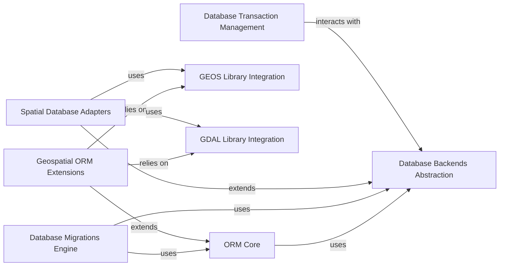

## Component Details

The Data Management subsystem in Django is responsible for abstracting and managing all interactions with various database systems. It provides a robust Object-Relational Mapper (ORM) for defining data models and performing database operations using Python objects. This subsystem also includes functionalities for database schema evolution through migrations, supports different database backends via a unified abstraction layer, and extends capabilities to handle complex geospatial data types and operations by integrating with external geospatial libraries like GEOS and GDAL. Furthermore, it ensures data integrity through comprehensive transaction management.

### ORM Core
Provides the fundamental Object-Relational Mapping (ORM) functionalities, including defining models, constructing queries, and managing data persistence. It translates Python objects into database queries and vice-versa.

**Related Classes/Methods**:

- `django.db.models.base.Model` (full file reference)
- <a href="https://github.com/django/django/blob/master/django/db/models/manager.py#L176-L177" target="_blank" rel="noopener noreferrer">`django.db.models.manager.Manager` (176:177)</a>
- <a href="https://github.com/django/django/blob/master/django/db/models/query.py#L279-L1000" target="_blank" rel="noopener noreferrer">`django.db.models.query.QuerySet` (279:1000)</a>
- <a href="https://github.com/django/django/blob/master/django/db/models/expressions.py#L518-L560" target="_blank" rel="noopener noreferrer">`django.db.models.expressions.Expression` (518:560)</a>
- `django.db.models.fields.Field` (full file reference)
- <a href="https://github.com/django/django/blob/master/django/db/models/lookups.py#L28-L202" target="_blank" rel="noopener noreferrer">`django.db.models.lookups.Lookup` (28:202)</a>
- <a href="https://github.com/django/django/blob/master/django/db/models/aggregates.py#L72-L220" target="_blank" rel="noopener noreferrer">`django.db.models.aggregates.Aggregate` (72:220)</a>
- <a href="https://github.com/django/django/blob/master/django/db/models/signals.py#L9-L39" target="_blank" rel="noopener noreferrer">`django.db.models.signals.ModelSignal` (9:39)</a>
- `django.db.models.base.Model:save` (full file reference)

### Database Backends Abstraction
Offers an abstract interface for various database systems, allowing Django's ORM to interact with different databases (e.g., PostgreSQL, MySQL, SQLite) through a unified API. It handles connection management, SQL generation, and data type mapping specific to each database.

**Related Classes/Methods**:

- <a href="https://github.com/django/django/blob/master/django/db/backends/base/base.py#L30-L792" target="_blank" rel="noopener noreferrer">`django.db.backends.base.base.BaseDatabaseWrapper` (30:792)</a>
- <a href="https://github.com/django/django/blob/master/django/db/backends/base/creation.py#L19-L401" target="_blank" rel="noopener noreferrer">`django.db.backends.base.creation.BaseDatabaseCreation` (19:401)</a>
- <a href="https://github.com/django/django/blob/master/django/db/backends/base/features.py#L5-L436" target="_blank" rel="noopener noreferrer">`django.db.backends.base.features.BaseDatabaseFeatures` (5:436)</a>
- <a href="https://github.com/django/django/blob/master/django/db/backends/base/introspection.py#L14-L215" target="_blank" rel="noopener noreferrer">`django.db.backends.base.introspection.BaseDatabaseIntrospection` (14:215)</a>
- <a href="https://github.com/django/django/blob/master/django/db/backends/base/operations.py#L15-L823" target="_blank" rel="noopener noreferrer">`django.db.backends.base.operations.BaseDatabaseOperations` (15:823)</a>
- <a href="https://github.com/django/django/blob/master/django/db/backends/base/schema.py#L77-L998" target="_blank" rel="noopener noreferrer">`django.db.backends.base.schema.BaseDatabaseSchemaEditor` (77:998)</a>
- <a href="https://github.com/django/django/blob/master/django/db/utils.py#L141-L197" target="_blank" rel="noopener noreferrer">`django.db.utils.ConnectionHandler` (141:197)</a>
- <a href="https://github.com/django/django/blob/master/django/db/backends/postgresql/base.py#L305-L342" target="_blank" rel="noopener noreferrer">`django.db.backends.postgresql.base.DatabaseWrapper:get_new_connection` (305:342)</a>

### Database Migrations Engine
Manages the evolution of the database schema, allowing developers to define and apply changes to the database in a structured and version-controlled manner.

**Related Classes/Methods**:

- <a href="https://github.com/django/django/blob/master/django/db/migrations/executor.py#L10-L412" target="_blank" rel="noopener noreferrer">`django.db.migrations.executor.MigrationExecutor` (10:412)</a>
- `django.db.migrations.autodetector.MigrationAutodetector` (full file reference)
- <a href="https://github.com/django/django/blob/master/django/db/migrations/loader.py#L21-L418" target="_blank" rel="noopener noreferrer">`django.db.migrations.loader.MigrationLoader` (21:418)</a>
- <a href="https://github.com/django/django/blob/master/django/db/migrations/recorder.py#L9-L111" target="_blank" rel="noopener noreferrer">`django.db.migrations.recorder.MigrationRecorder` (9:111)</a>
- <a href="https://github.com/django/django/blob/master/django/db/migrations/operations/base.py#L16-L177" target="_blank" rel="noopener noreferrer">`django.db.migrations.operations.base.Operation` (16:177)</a>
- <a href="https://github.com/django/django/blob/master/django/db/migrations/state.py#L621-L732" target="_blank" rel="noopener noreferrer">`django.db.migrations.state.StateApps` (621:732)</a>
- <a href="https://github.com/django/django/blob/master/django/db/migrations/executor.py#L94-L145" target="_blank" rel="noopener noreferrer">`django.db.migrations.executor.MigrationExecutor:migrate` (94:145)</a>

### Geospatial ORM Extensions
Extends Django's ORM with specialized fields, lookups, and aggregates for handling geospatial data types and operations.

**Related Classes/Methods**:

- <a href="https://github.com/django/django/blob/master/django/contrib/gis/db/models/fields.py#L225-L322" target="_blank" rel="noopener noreferrer">`django.contrib.gis.db.models.fields.GeometryField` (225:322)</a>
- <a href="https://github.com/django/django/blob/master/django/contrib/gis/db/models/functions.py#L111-L112" target="_blank" rel="noopener noreferrer">`django.contrib.gis.db.models.functions.GeoFunc` (111:112)</a>
- <a href="https://github.com/django/django/blob/master/django/contrib/gis/db/models/lookups.py#L14-L90" target="_blank" rel="noopener noreferrer">`django.contrib.gis.db.models.lookups.GISLookup` (14:90)</a>
- <a href="https://github.com/django/django/blob/master/django/contrib/gis/db/models/aggregates.py#L13-L57" target="_blank" rel="noopener noreferrer">`django.contrib.gis.db.models.aggregates.GeoAggregate` (13:57)</a>

### GEOS Library Integration
Provides Python bindings and utilities for interacting with the GEOS (Geometry Engine - Open Source) library, enabling advanced geometric operations.

**Related Classes/Methods**:

- <a href="https://github.com/django/django/blob/master/django/contrib/gis/geos/geometry.py#L727-L787" target="_blank" rel="noopener noreferrer">`django.contrib.gis.geos.geometry.GEOSGeometry` (727:787)</a>
- <a href="https://github.com/django/django/blob/master/django/contrib/gis/geos/libgeos.py#L135-L165" target="_blank" rel="noopener noreferrer">`django.contrib.gis.geos.libgeos.GEOSFuncFactory` (135:165)</a>
- <a href="https://github.com/django/django/blob/master/django/contrib/gis/geos/collections.py#L14-L92" target="_blank" rel="noopener noreferrer">`django.contrib.gis.geos.collections.GeometryCollection` (14:92)</a>
- <a href="https://github.com/django/django/blob/master/django/contrib/gis/geos/point.py#L9-L162" target="_blank" rel="noopener noreferrer">`django.contrib.gis.geos.point.Point` (9:162)</a>
- <a href="https://github.com/django/django/blob/master/django/contrib/gis/geos/linestring.py#L9-L181" target="_blank" rel="noopener noreferrer">`django.contrib.gis.geos.linestring.LineString` (9:181)</a>
- <a href="https://github.com/django/django/blob/master/django/contrib/gis/geos/polygon.py#L7-L189" target="_blank" rel="noopener noreferrer">`django.contrib.gis.geos.polygon.Polygon` (7:189)</a>
- <a href="https://github.com/django/django/blob/master/django/contrib/gis/geos/geometry.py#L730-L787" target="_blank" rel="noopener noreferrer">`django.contrib.gis.geos.geometry.GEOSGeometry:__init__` (730:787)</a>

### GDAL Library Integration
Provides Python bindings and utilities for interacting with the GDAL (Geospatial Data Abstraction Library) library, supporting various geospatial data formats and transformations.

**Related Classes/Methods**:

- <a href="https://github.com/django/django/blob/master/django/contrib/gis/gdal/datasource.py#L51-L129" target="_blank" rel="noopener noreferrer">`django.contrib.gis.gdal.datasource.DataSource` (51:129)</a>
- <a href="https://github.com/django/django/blob/master/django/contrib/gis/gdal/driver.py#L9-L94" target="_blank" rel="noopener noreferrer">`django.contrib.gis.gdal.driver.Driver` (9:94)</a>
- <a href="https://github.com/django/django/blob/master/django/contrib/gis/gdal/geometries.py#L61-L581" target="_blank" rel="noopener noreferrer">`django.contrib.gis.gdal.geometries.OGRGeometry` (61:581)</a>
- <a href="https://github.com/django/django/blob/master/django/contrib/gis/gdal/srs.py#L45-L343" target="_blank" rel="noopener noreferrer">`django.contrib.gis.gdal.srs.SpatialReference` (45:343)</a>

### Spatial Database Adapters
Specific database adapters that extend the standard database backends to support spatial data types and functions provided by PostGIS, SpatiaLite, and MySQL's spatial extensions.

**Related Classes/Methods**:

- <a href="https://github.com/django/django/blob/master/django/contrib/gis/db/backends/postgis/base.py#L91-L161" target="_blank" rel="noopener noreferrer">`django.contrib.gis.db.backends.postgis.base.DatabaseWrapper` (91:161)</a>
- <a href="https://github.com/django/django/blob/master/django/contrib/gis/db/backends/spatialite/base.py#L14-L79" target="_blank" rel="noopener noreferrer">`django.contrib.gis.db.backends.spatialite.base.DatabaseWrapper` (14:79)</a>
- <a href="https://github.com/django/django/blob/master/django/contrib/gis/db/backends/mysql/base.py#L9-L14" target="_blank" rel="noopener noreferrer">`django.contrib.gis.db.backends.mysql.base.DatabaseWrapper` (9:14)</a>
- <a href="https://github.com/django/django/blob/master/django/contrib/gis/db/backends/oracle/base.py#L9-L14" target="_blank" rel="noopener noreferrer">`django.contrib.gis.db.backends.oracle.base.DatabaseWrapper` (9:14)</a>

### Database Transaction Management
Provides mechanisms for managing database transactions, ensuring data integrity and atomicity of operations.

**Related Classes/Methods**:

- <a href="https://github.com/django/django/blob/master/django/db/transaction.py#L316-L323" target="_blank" rel="noopener noreferrer">`django.db.transaction.atomic` (316:323)</a>
- <a href="https://github.com/django/django/blob/master/django/db/transaction.py#L12-L15" target="_blank" rel="noopener noreferrer">`django.db.transaction.TransactionManagementError` (12:15)</a>

### [FAQ](https://github.com/CodeBoarding/GeneratedOnBoardings/tree/main?tab=readme-ov-file#faq)