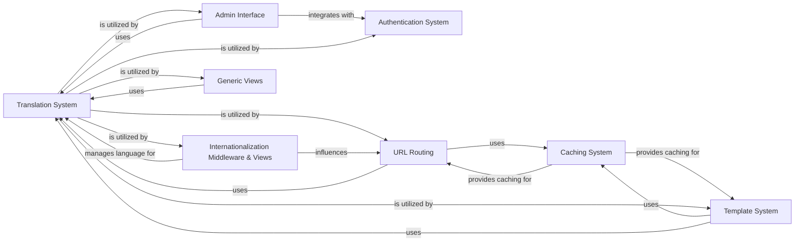

## Component Details

This graph illustrates the core components of Django's internationalization and caching systems, along with their interactions with other key parts of the framework. The Translation System provides robust multi-language support, while the Caching System optimizes performance by storing frequently accessed data. These components are deeply integrated with URL Routing, the Template System, and various middleware and views to ensure a seamless and efficient user experience across different languages and for improved application responsiveness.

### Translation System
This component provides core functionalities for internationalization and localization in Django. It handles retrieving translated strings, managing the active language, and providing language-related information.

**Related Classes/Methods**:

- <a href="https://github.com/django/django/blob/master/django/utils/translation/trans_real.py#L367-L390" target="_blank" rel="noopener noreferrer">`django.utils.translation.trans_real:gettext` (367:390)</a>
- <a href="https://github.com/django/django/blob/master/django/utils/translation/trans_real.py#L425-L430" target="_blank" rel="noopener noreferrer">`django.utils.translation.trans_real:ngettext` (425:430)</a>
- <a href="https://github.com/django/django/blob/master/django/utils/translation/trans_real.py#L393-L401" target="_blank" rel="noopener noreferrer">`django.utils.translation.trans_real:pgettext` (393:401)</a>
- <a href="https://github.com/django/django/blob/master/django/utils/translation/trans_real.py#L404-L411" target="_blank" rel="noopener noreferrer">`django.utils.translation.trans_real:gettext_noop` (404:411)</a>
- <a href="https://github.com/django/django/blob/master/django/utils/translation/trans_real.py#L324-L333" target="_blank" rel="noopener noreferrer">`django.utils.translation.trans_real:get_language` (324:333)</a>
- `django.utils.translation.get_language_info` (100:105)
- <a href="https://github.com/django/django/blob/master/django/utils/translation/trans_real.py#L336-L348" target="_blank" rel="noopener noreferrer">`django.utils.translation.trans_real:get_language_bidi` (336:348)</a>
- <a href="https://github.com/django/django/blob/master/django/utils/translation/trans_real.py#L295-L302" target="_blank" rel="noopener noreferrer">`django.utils.translation.trans_real:activate` (295:302)</a>
- <a href="https://github.com/django/django/blob/master/django/utils/translation/trans_real.py#L462-L478" target="_blank" rel="noopener noreferrer">`django.utils.translation.trans_real:check_for_language` (462:478)</a>
- <a href="https://github.com/django/django/blob/master/django/utils/translation/trans_real.py#L491-L539" target="_blank" rel="noopener noreferrer">`django.utils.translation.trans_real:get_supported_language_variant` (491:539)</a>
- <a href="https://github.com/django/django/blob/master/django/utils/translation/trans_real.py#L542-L556" target="_blank" rel="noopener noreferrer">`django.utils.translation.trans_real:get_language_from_path` (542:556)</a>
- <a href="https://github.com/django/django/blob/master/django/utils/translation/trans_real.py#L559-L603" target="_blank" rel="noopener noreferrer">`django.utils.translation.trans_real:get_language_from_request` (559:603)</a>
- <a href="https://github.com/django/django/blob/master/django/utils/translation/trans_real.py#L1-L650" target="_blank" rel="noopener noreferrer">`django.utils.translation.trans_real` (1:650)</a>
- <a href="https://github.com/django/django/blob/master/django/utils/translation/trans_null.py#L14-L14" target="_blank" rel="noopener noreferrer">`django.utils.translation.trans_null` (14:14)</a>
- `django.utils.translation.lazy_number` (15:15)
- `django.utils.translation.override` (16:16)
- `django.utils.translation.get_current_timezone_name` (107:110)

### Caching System
This component provides a unified interface for various caching backends (database, local memory, file-based, Memcached, Redis). It handles storing, retrieving, and managing cached data to improve application performance.

**Related Classes/Methods**:

- <a href="https://github.com/django/django/blob/master/django/core/cache/backends/base.py#L58-L390" target="_blank" rel="noopener noreferrer">`django.core.cache.backends.base.BaseCache` (58:390)</a>
- <a href="https://github.com/django/django/blob/master/django/core/cache/backends/db.py#L43-L294" target="_blank" rel="noopener noreferrer">`django.core.cache.backends.db.DatabaseCache` (43:294)</a>
- <a href="https://github.com/django/django/blob/master/django/core/cache/backends/dummy.py#L6-L34" target="_blank" rel="noopener noreferrer">`django.core.cache.backends.dummy.DummyCache` (6:34)</a>
- <a href="https://github.com/django/django/blob/master/django/core/cache/backends/locmem.py#L17-L118" target="_blank" rel="noopener noreferrer">`django.core.cache.backends.locmem.LocMemCache` (17:118)</a>
- <a href="https://github.com/django/django/blob/master/django/core/cache/backends/filebased.py#L17-L171" target="_blank" rel="noopener noreferrer">`django.core.cache.backends.filebased.FileBasedCache` (17:171)</a>
- <a href="https://github.com/django/django/blob/master/django/core/cache/backends/memcached.py#L15-L141" target="_blank" rel="noopener noreferrer">`django.core.cache.backends.memcached.BaseMemcachedCache` (15:141)</a>
- <a href="https://github.com/django/django/blob/master/django/core/cache/backends/memcached.py#L144-L170" target="_blank" rel="noopener noreferrer">`django.core.cache.backends.memcached.PyLibMCCache` (144:170)</a>
- <a href="https://github.com/django/django/blob/master/django/core/cache/backends/redis.py#L160-L234" target="_blank" rel="noopener noreferrer">`django.core.cache.backends.redis.RedisCache` (160:234)</a>
- <a href="https://github.com/django/django/blob/master/django/core/cache/utils.py#L6-L12" target="_blank" rel="noopener noreferrer">`django.core.cache.utils.make_template_fragment_key` (6:12)</a>
- <a href="https://github.com/django/django/blob/master/django/core/cache/backends/base.py#L396-L406" target="_blank" rel="noopener noreferrer">`django.core.cache.backends.base.memcache_key_warnings` (396:406)</a>
- <a href="https://github.com/django/django/blob/master/django/core/cache/backends/base.py#L144-L149" target="_blank" rel="noopener noreferrer">`django.core.cache.backends.base.BaseCache:get` (144:149)</a>
- <a href="https://github.com/django/django/blob/master/django/core/cache/backends/base.py#L156-L161" target="_blank" rel="noopener noreferrer">`django.core.cache.backends.base.BaseCache:set` (156:161)</a>

### Admin Interface
This component provides an automatic administrative interface for Django models, allowing site administrators to manage content. It includes widgets, models, options, actions, and site configurations.

**Related Classes/Methods**:

- <a href="https://github.com/django/django/blob/master/django/contrib/admin/widgets.py#L1-L300" target="_blank" rel="noopener noreferrer">`django.contrib.admin.widgets` (1:300)</a>
- <a href="https://github.com/django/django/blob/master/django/contrib/admin/models.py#L1-L100" target="_blank" rel="noopener noreferrer">`django.contrib.admin.models` (1:100)</a>
- <a href="https://github.com/django/django/blob/master/django/contrib/admin/options.py#L1-L1500" target="_blank" rel="noopener noreferrer">`django.contrib.admin.options` (1:1500)</a>
- <a href="https://github.com/django/django/blob/master/django/contrib/admin/actions.py#L1-L100" target="_blank" rel="noopener noreferrer">`django.contrib.admin.actions` (1:100)</a>
- <a href="https://github.com/django/django/blob/master/django/contrib/admin/sites.py#L1-L300" target="_blank" rel="noopener noreferrer">`django.contrib.admin.sites` (1:300)</a>
- <a href="https://github.com/django/django/blob/master/django/contrib/admin/tests.py#L1-L1000" target="_blank" rel="noopener noreferrer">`django.contrib.admin.tests` (1:1000)</a>

### Authentication System
This component handles user authentication, authorization, and password management. It includes password hashers, validation rules, views for login/logout, and admin integration.

**Related Classes/Methods**:

- <a href="https://github.com/django/django/blob/master/django/contrib/auth/hashers.py#L1-L300" target="_blank" rel="noopener noreferrer">`django.contrib.auth.hashers` (1:300)</a>
- <a href="https://github.com/django/django/blob/master/django/contrib/auth/password_validation.py#L1-L150" target="_blank" rel="noopener noreferrer">`django.contrib.auth.password_validation` (1:150)</a>
- <a href="https://github.com/django/django/blob/master/django/contrib/auth/views.py#L1-L300" target="_blank" rel="noopener noreferrer">`django.contrib.auth.views` (1:300)</a>
- <a href="https://github.com/django/django/blob/master/django/contrib/auth/forms.py#L1-L300" target="_blank" rel="noopener noreferrer">`django.contrib.auth.forms` (1:300)</a>
- <a href="https://github.com/django/django/blob/master/django/contrib/auth/admin.py#L1-L150" target="_blank" rel="noopener noreferrer">`django.contrib.auth.admin` (1:150)</a>

### URL Routing
This component is responsible for mapping URLs to views and managing URL patterns, including support for internationalized URLs. It plays a crucial role in dispatching requests to the correct handlers.

**Related Classes/Methods**:

- <a href="https://github.com/django/django/blob/master/django/urls/resolvers.py#L130-L155" target="_blank" rel="noopener noreferrer">`django.urls.resolvers.LocaleRegexDescriptor` (130:155)</a>
- <a href="https://github.com/django/django/blob/master/django/urls/resolvers.py#L386-L417" target="_blank" rel="noopener noreferrer">`django.urls.resolvers.LocalePrefixPattern` (386:417)</a>
- <a href="https://github.com/django/django/blob/master/django/urls/resolvers.py#L293-L311" target="_blank" rel="noopener noreferrer">`django.urls.resolvers.LocaleRegexRouteDescriptor` (293:311)</a>
- <a href="https://github.com/django/django/blob/master/django/urls/resolvers.py#L501-L839" target="_blank" rel="noopener noreferrer">`django.urls.resolvers.URLResolver` (501:839)</a>
- <a href="https://github.com/django/django/blob/master/django/conf/urls/i18n.py#L1-L50" target="_blank" rel="noopener noreferrer">`django.conf.urls.i18n` (1:50)</a>

### Template System
This component provides Django's powerful template language for rendering dynamic content. It includes context management, default tags and filters, and internationalization-aware template tags.

**Related Classes/Methods**:

- <a href="https://github.com/django/django/blob/master/django/template/context.py#L28-L135" target="_blank" rel="noopener noreferrer">`django.template.context.BaseContext` (28:135)</a>
- <a href="https://github.com/django/django/blob/master/django/template/defaulttags.py#L10-L20" target="_blank" rel="noopener noreferrer">`django.template.defaulttags.NowNode` (10:20)</a>
- <a href="https://github.com/django/django/blob/master/django/template/defaultfilters.py#L1-L500" target="_blank" rel="noopener noreferrer">`django.template.defaultfilters` (1:500)</a>
- <a href="https://github.com/django/django/blob/master/django/template/context_processors.py#L1-L100" target="_blank" rel="noopener noreferrer">`django.template.context_processors` (1:100)</a>
- <a href="https://github.com/django/django/blob/master/django/templatetags/i18n.py#L1-L100" target="_blank" rel="noopener noreferrer">`django.templatetags.i18n` (1:100)</a>
- <a href="https://github.com/django/django/blob/master/django/templatetags/cache.py#L1-L50" target="_blank" rel="noopener noreferrer">`django.templatetags.cache` (1:50)</a>

### Internationalization Middleware & Views
This component handles the detection and activation of the user's preferred language based on request information. It also provides views for serving JavaScript internationalization catalogs and setting the language.

**Related Classes/Methods**:

- <a href="https://github.com/django/django/blob/master/django/middleware/locale.py#L10-L80" target="_blank" rel="noopener noreferrer">`django.middleware.locale.LocaleMiddleware` (10:80)</a>
- <a href="https://github.com/django/django/blob/master/django/views/i18n.py#L30-L74" target="_blank" rel="noopener noreferrer">`django.views.i18n.set_language` (30:74)</a>
- <a href="https://github.com/django/django/blob/master/django/views/i18n.py#L98-L229" target="_blank" rel="noopener noreferrer">`django.views.i18n.JavaScriptCatalog` (98:229)</a>

### Generic Views
This component offers a set of reusable class-based views that implement common web development patterns, such as displaying lists of objects, handling forms, and managing date-based archives.

**Related Classes/Methods**:

- <a href="https://github.com/django/django/blob/master/django/views/generic/list.py#L9-L147" target="_blank" rel="noopener noreferrer">`django.views.generic.list.MultipleObjectMixin` (9:147)</a>
- <a href="https://github.com/django/django/blob/master/django/views/generic/list.py#L150-L179" target="_blank" rel="noopener noreferrer">`django.views.generic.list.BaseListView` (150:179)</a>
- <a href="https://github.com/django/django/blob/master/django/views/generic/dates.py#L21-L68" target="_blank" rel="noopener noreferrer">`django.views.generic.dates.YearMixin` (21:68)</a>
- <a href="https://github.com/django/django/blob/master/django/views/generic/dates.py#L71-L121" target="_blank" rel="noopener noreferrer">`django.views.generic.dates.MonthMixin` (71:121)</a>
- <a href="https://github.com/django/django/blob/master/django/views/generic/dates.py#L124-L168" target="_blank" rel="noopener noreferrer">`django.views.generic.dates.DayMixin` (124:168)</a>
- <a href="https://github.com/django/django/blob/master/django/views/generic/dates.py#L171-L232" target="_blank" rel="noopener noreferrer">`django.views.generic.dates.WeekMixin` (171:232)</a>
- <a href="https://github.com/django/django/blob/master/django/views/generic/dates.py#L302-L390" target="_blank" rel="noopener noreferrer">`django.views.generic.dates.BaseDateListView` (302:390)</a>
- <a href="https://github.com/django/django/blob/master/django/views/generic/dates.py#L419-L466" target="_blank" rel="noopener noreferrer">`django.views.generic.dates.BaseYearArchiveView` (419:466)</a>
- <a href="https://github.com/django/django/blob/master/django/views/generic/dates.py#L475-L512" target="_blank" rel="noopener noreferrer">`django.views.generic.dates.BaseMonthArchiveView` (475:512)</a>
- <a href="https://github.com/django/django/blob/master/django/views/generic/dates.py#L521-L574" target="_blank" rel="noopener noreferrer">`django.views.generic.dates.BaseWeekArchiveView` (521:574)</a>
- <a href="https://github.com/django/django/blob/master/django/views/generic/dates.py#L652-L695" target="_blank" rel="noopener noreferrer">`django.views.generic.dates.BaseDateDetailView` (652:695)</a>
- <a href="https://github.com/django/django/blob/master/django/views/generic/dates.py#L707-L725" target="_blank" rel="noopener noreferrer">`django.views.generic.dates._date_from_string` (707:725)</a>

### [FAQ](https://github.com/CodeBoarding/GeneratedOnBoardings/tree/main?tab=readme-ov-file#faq)