```mermaid
graph LR
    Form_Handling["Form Handling"]
    Admin_Site_Management["Admin Site Management"]
    Admin_Model_Management["Admin Model Management"]
    URL_Resolution["URL Resolution"]
    HTTP_Response_Handling["HTTP Response Handling"]
    Error_Utilities["Error Utilities"]
    Generic_View_Processing["Generic View Processing"]
    Database_Transaction_Management["Database Transaction Management"]
    Internationalization_Utilities["Internationalization Utilities"]
    HTML_Rendering_Utilities["HTML Rendering Utilities"]
    Form_Handling -- "validates data for" --> Admin_Model_Management
    URL_Resolution -- "generates URLs for" --> Admin_Site_Management
    Admin_Site_Management -- "redirects via" --> HTTP_Response_Handling
    Form_Handling -- "reports errors to" --> Error_Utilities
    Admin_Site_Management -- "uses for view processing" --> Generic_View_Processing
    Database_Transaction_Management -- "ensures atomicity for" --> Admin_Model_Management
    Internationalization_Utilities -- "provides translations for" --> Admin_Model_Management
    Admin_Model_Management -- "renders HTML using" --> HTML_Rendering_Utilities
    Error_Utilities -- "handles form errors from" --> Form_Handling
    Admin_Model_Management -- "invokes for URL generation" --> URL_Resolution
    Form_Handling -- "utilizes for HTML output" --> HTML_Rendering_Utilities
    Admin_Model_Management -- "redirects through" --> HTTP_Response_Handling
    Internationalization_Utilities -- "provides language support to" --> Form_Handling
```

## Component Details

This component overview describes the 'User Interface & Forms' subsystem in Django, focusing on how user input is handled, validated, and managed within the administrative interface. The core flow involves form processing for data input and validation, model management within the admin site, and the underlying mechanisms for URL routing, HTTP responses, and database transactions. The purpose is to provide a robust and extensible framework for building interactive web forms and an automated administrative backend for content management.

### Form Handling
This component, primarily represented by `django.forms.forms.BaseForm`, is responsible for the core logic of Django forms. It handles data binding, validation, cleaning of fields and the entire form, and managing errors. It provides methods for checking if data has changed, adding errors, and rendering the form.

**Related Classes/Methods**:

- <a href="https://github.com/django/django/blob/master/django/forms/forms.py#L52-L429" target="_blank" rel="noopener noreferrer">`django.forms.forms.BaseForm` (52:429)</a>
- <a href="https://github.com/django/django/blob/master/django/forms/forms.py#L324-L339" target="_blank" rel="noopener noreferrer">`django.forms.forms.BaseForm:full_clean` (324:339)</a>
- `django.forms.models.BaseModelForm:save` (full file reference)
- `django.forms.fields` (full file reference)
- `django.forms.widgets` (full file reference)

### Admin Site Management
The `django.contrib.admin.sites.AdminSite` component manages the overall Django admin interface. It is responsible for discovering registered models, handling URL routing for admin views, and managing user permissions within the admin site. It acts as the central hub for all administrative functionalities.

**Related Classes/Methods**:

- <a href="https://github.com/django/django/blob/master/django/contrib/admin/sites.py#L30-L606" target="_blank" rel="noopener noreferrer">`django.contrib.admin.sites.AdminSite` (30:606)</a>
- <a href="https://github.com/django/django/blob/master/django/contrib/admin/sites.py#L257-L321" target="_blank" rel="noopener noreferrer">`django.contrib.admin.sites.AdminSite:get_urls` (257:321)</a>

### Admin Model Management
The `django.contrib.admin.options.ModelAdmin` component provides the interface for managing individual models within the Django admin. It handles the display, creation, modification, and deletion of model instances, including form rendering, saving data, and logging changes. It interacts heavily with form handling and permission systems.

**Related Classes/Methods**:

- <a href="https://github.com/django/django/blob/master/django/contrib/admin/options.py#L635-L1000" target="_blank" rel="noopener noreferrer">`django.contrib.admin.options.ModelAdmin` (635:1000)</a>
- `django.contrib.admin.options.ModelAdmin:changeform_view` (full file reference)

### URL Resolution
This component, centered around `django.urls.base.reverse`, is responsible for dynamically generating URLs based on view names and arguments. It plays a crucial role in navigation and linking within Django applications, ensuring that URLs are consistent and can be easily changed without breaking links.

**Related Classes/Methods**:

- <a href="https://github.com/django/django/blob/master/django/urls/base.py#L28-L108" target="_blank" rel="noopener noreferrer">`django.urls.base.reverse` (28:108)</a>

### HTTP Response Handling
The `django.http.response.HttpResponseRedirect` component is part of Django's HTTP layer, specifically handling HTTP redirects. It is used to send a redirect response to the client's browser, directing it to a different URL. This is essential for various web application flows, such as post-submission redirects or authentication redirects.

**Related Classes/Methods**:

- <a href="https://github.com/django/django/blob/master/django/http/response.py#L655-L657" target="_blank" rel="noopener noreferrer">`django.http.response.HttpResponseRedirect` (655:657)</a>

### Error Utilities
The `django.forms.utils.ErrorList` component is a specialized list for managing and rendering form errors. It provides methods to add errors and format them for display, ensuring a consistent way of presenting validation feedback to users.

**Related Classes/Methods**:

- <a href="https://github.com/django/django/blob/master/django/forms/utils.py#L141-L209" target="_blank" rel="noopener noreferrer">`django.forms.utils.ErrorList` (141:209)</a>

### Generic View Processing
The `django.views.generic.base.View` component serves as the base class for all class-based views in Django. It provides fundamental functionalities for handling HTTP requests and dispatching them to appropriate methods (e.g., `get`, `post`). It's a cornerstone for building reusable and structured web views.

**Related Classes/Methods**:

- <a href="https://github.com/django/django/blob/master/django/views/generic/base.py#L37-L181" target="_blank" rel="noopener noreferrer">`django.views.generic.base.View` (37:181)</a>

### Database Transaction Management
The `django.db.transaction.atomic` component provides a mechanism for ensuring atomicity of database operations. It allows a block of code to be executed within a single database transaction, meaning either all operations within the block succeed and are committed, or if any fail, all are rolled back, maintaining data integrity.

**Related Classes/Methods**:

- <a href="https://github.com/django/django/blob/master/django/db/transaction.py#L316-L323" target="_blank" rel="noopener noreferrer">`django.db.transaction.atomic` (316:323)</a>

### Internationalization Utilities
The `django.utils.translation.gettext` component is part of Django's internationalization (i18n) framework. It provides functions for marking strings for translation and retrieving translated versions based on the active language, enabling Django applications to support multiple languages.

**Related Classes/Methods**:

- `django.utils.translation.gettext` (full file reference)

### HTML Rendering Utilities
The `django.utils.html.format_html` component provides utilities for safely formatting HTML strings. It helps prevent cross-site scripting (XSS) vulnerabilities by automatically escaping unsafe characters, ensuring that dynamically generated HTML content is secure.

**Related Classes/Methods**:

- <a href="https://github.com/django/django/blob/master/django/utils/html.py#L130-L140" target="_blank" rel="noopener noreferrer">`django.utils.html.format_html` (130:140)</a>

### [FAQ](https://github.com/CodeBoarding/GeneratedOnBoardings/tree/main?tab=readme-ov-file#faq)