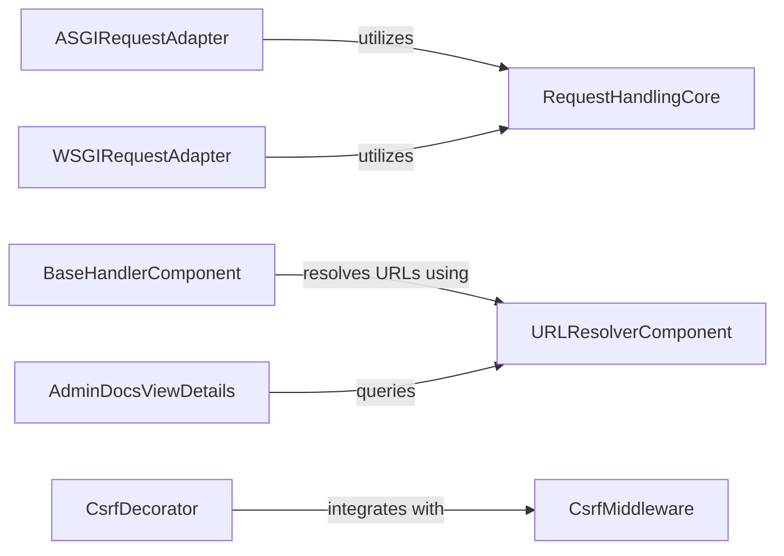

## Component Details

Manages the HTTP request and response cycle, including parsing incoming requests, applying middleware, and resolving URLs to appropriate views.

### RequestHandlingCore
This component is responsible for the fundamental parsing and management of HTTP request data, including POST data and uploaded files. It provides the base functionality for handling various aspects of an incoming request.

**Related Classes/Methods**:

- <a href="https://github.com/django/django/blob/master/django/http/request.py#L53-L470" target="_blank" rel="noopener noreferrer">`django.http.request.HttpRequest` (53:470)</a>
- <a href="https://github.com/django/django/blob/master/django/http/request.py#L395-L437" target="_blank" rel="noopener noreferrer">`django.http.request.HttpRequest:_load_post_and_files` (395:437)</a>
- <a href="https://github.com/django/django/blob/master/django/http/request.py#L391-L393" target="_blank" rel="noopener noreferrer">`django.http.request.HttpRequest._mark_post_parse_error` (391:393)</a>
- <a href="https://github.com/django/django/blob/master/django/http/request.py#L352-L362" target="_blank" rel="noopener noreferrer">`django.http.request.HttpRequest.parse_file_upload` (352:362)</a>
- <a href="https://github.com/django/django/blob/master/django/http/request.py#L524-L692" target="_blank" rel="noopener noreferrer">`django.http.request.QueryDict` (524:692)</a>
- <a href="https://github.com/django/django/blob/master/django/utils/datastructures.py#L49-L217" target="_blank" rel="noopener noreferrer">`django.utils.datastructures.MultiValueDict` (49:217)</a>
- <a href="https://github.com/django/django/blob/master/django/core/exceptions.py#L99-L102" target="_blank" rel="noopener noreferrer">`django.core.exceptions.BadRequest` (99:102)</a>

### CsrfMiddleware
This component implements the core logic for Cross-Site Request Forgery (CSRF) protection, validating tokens, checking origins and referers, and managing CSRF cookies.

**Related Classes/Methods**:

- <a href="https://github.com/django/django/blob/master/django/middleware/csrf.py#L165-L483" target="_blank" rel="noopener noreferrer">`django.middleware.csrf.CsrfViewMiddleware` (165:483)</a>
- <a href="https://github.com/django/django/blob/master/django/middleware/csrf.py#L414-L469" target="_blank" rel="noopener noreferrer">`django.middleware.csrf.CsrfViewMiddleware:process_view` (414:469)</a>
- <a href="https://github.com/django/django/blob/master/django/middleware/csrf.py#L202-L207" target="_blank" rel="noopener noreferrer">`django.middleware.csrf.CsrfViewMiddleware._accept` (202:207)</a>
- <a href="https://github.com/django/django/blob/master/django/middleware/csrf.py#L209-L219" target="_blank" rel="noopener noreferrer">`django.middleware.csrf.CsrfViewMiddleware._reject` (209:219)</a>
- <a href="https://github.com/django/django/blob/master/django/middleware/csrf.py#L271-L295" target="_blank" rel="noopener noreferrer">`django.middleware.csrf.CsrfViewMiddleware._origin_verified` (271:295)</a>
- <a href="https://github.com/django/django/blob/master/django/middleware/csrf.py#L297-L340" target="_blank" rel="noopener noreferrer">`django.middleware.csrf.CsrfViewMiddleware._check_referer` (297:340)</a>
- <a href="https://github.com/django/django/blob/master/django/middleware/csrf.py#L349-L399" target="_blank" rel="noopener noreferrer">`django.middleware.csrf.CsrfViewMiddleware._check_token` (349:399)</a>
- <a href="https://github.com/django/django/blob/master/django/middleware/csrf.py#L96-L114" target="_blank" rel="noopener noreferrer">`django.middleware.csrf.get_token` (96:114)</a>

### URLResolverComponent
This component is responsible for resolving incoming URLs to their corresponding view functions, managing URL patterns, and handling resolution errors.

**Related Classes/Methods**:

- <a href="https://github.com/django/django/blob/master/django/urls/resolvers.py#L501-L839" target="_blank" rel="noopener noreferrer">`django.urls.resolvers.URLResolver` (501:839)</a>
- <a href="https://github.com/django/django/blob/master/django/urls/resolvers.py#L668-L714" target="_blank" rel="noopener noreferrer">`django.urls.resolvers.URLResolver:resolve` (668:714)</a>
- <a href="https://github.com/django/django/blob/master/django/urls/resolvers.py#L649-L653" target="_blank" rel="noopener noreferrer">`django.urls.resolvers.URLResolver._extend_tried` (649:653)</a>
- <a href="https://github.com/django/django/blob/master/django/urls/resolvers.py#L656-L661" target="_blank" rel="noopener noreferrer">`django.urls.resolvers.URLResolver._join_route` (656:661)</a>
- <a href="https://github.com/django/django/blob/master/django/urls/resolvers.py#L34-L105" target="_blank" rel="noopener noreferrer">`django.urls.resolvers.ResolverMatch` (34:105)</a>
- <a href="https://github.com/django/django/blob/master/django/urls/exceptions.py#L4-L5" target="_blank" rel="noopener noreferrer">`django.urls.exceptions.Resolver404` (4:5)</a>
- <a href="https://github.com/django/django/blob/master/django/urls/resolvers.py#L108-L111" target="_blank" rel="noopener noreferrer">`django.urls.resolvers.get_resolver` (108:111)</a>
- <a href="https://github.com/django/django/blob/master/django/urls/base.py#L148-L158" target="_blank" rel="noopener noreferrer">`django.urls.base.set_urlconf` (148:158)</a>

### ASGIRequestAdapter
This component adapts incoming requests from an ASGI server environment into Django's HttpRequest format, specifically handling the retrieval of POST data and files.

**Related Classes/Methods**:

- <a href="https://github.com/django/django/blob/master/django/core/handlers/asgi.py#L38-L136" target="_blank" rel="noopener noreferrer">`django.core.handlers.asgi.ASGIRequest` (38:136)</a>
- <a href="https://github.com/django/django/blob/master/django/core/handlers/asgi.py#L114-L117" target="_blank" rel="noopener noreferrer">`django.core.handlers.asgi.ASGIRequest:_get_post` (114:117)</a>
- <a href="https://github.com/django/django/blob/master/django/core/handlers/asgi.py#L122-L125" target="_blank" rel="noopener noreferrer">`django.core.handlers.asgi.ASGIRequest:_get_files` (122:125)</a>

### WSGIRequestAdapter
This component adapts incoming requests from a WSGI server environment into Django's HttpRequest format, specifically handling the retrieval of POST data and files.

**Related Classes/Methods**:

- <a href="https://github.com/django/django/blob/master/django/core/handlers/wsgi.py#L56-L110" target="_blank" rel="noopener noreferrer">`django.core.handlers.wsgi.WSGIRequest` (56:110)</a>
- <a href="https://github.com/django/django/blob/master/django/core/handlers/wsgi.py#L91-L94" target="_blank" rel="noopener noreferrer">`django.core.handlers.wsgi.WSGIRequest:_get_post` (91:94)</a>
- <a href="https://github.com/django/django/blob/master/django/core/handlers/wsgi.py#L105-L108" target="_blank" rel="noopener noreferrer">`django.core.handlers.wsgi.WSGIRequest:FILES` (105:108)</a>

### BaseHandlerComponent
This component provides the foundational request handling mechanism, including middleware processing, URL resolution, and dispatching requests to views.

**Related Classes/Methods**:

- <a href="https://github.com/django/django/blob/master/django/core/handlers/base.py#L20-L365" target="_blank" rel="noopener noreferrer">`django.core.handlers.base.BaseHandler` (20:365)</a>
- <a href="https://github.com/django/django/blob/master/django/core/handlers/base.py#L300-L315" target="_blank" rel="noopener noreferrer">`django.core.handlers.base.BaseHandler:resolve_request` (300:315)</a>

### CsrfDecorator
This component provides a decorator to ensure that a CSRF cookie is set for a given view, often used in conjunction with the CSRF middleware.

**Related Classes/Methods**:

- <a href="https://github.com/django/django/blob/master/django/views/decorators/csrf.py#L32-L40" target="_blank" rel="noopener noreferrer">`django.views.decorators.csrf._EnsureCsrfCookie` (32:40)</a>
- <a href="https://github.com/django/django/blob/master/django/views/decorators/csrf.py#L36-L40" target="_blank" rel="noopener noreferrer">`django.views.decorators.csrf._EnsureCsrfCookie:process_view` (36:40)</a>

### AdminDocsViewDetails
This component is responsible for extracting and displaying detailed documentation for views within the Django administration interface.

**Related Classes/Methods**:

- <a href="https://github.com/django/django/blob/master/django/contrib/admindocs/views.py#L169-L207" target="_blank" rel="noopener noreferrer">`django.contrib.admindocs.views.ViewDetailView` (169:207)</a>
- <a href="https://github.com/django/django/blob/master/django/contrib/admindocs/views.py#L173-L187" target="_blank" rel="noopener noreferrer">`django.contrib.admindocs.views.ViewDetailView:_get_view_func` (173:187)</a>
- <a href="https://github.com/django/django/blob/master/django/urls/base.py#L161-L166" target="_blank" rel="noopener noreferrer">`django.urls.base.get_urlconf` (161:166)</a>
- <a href="https://github.com/django/django/blob/master/django/urls/utils.py#L59-L66" target="_blank" rel="noopener noreferrer">`django.urls.utils.get_mod_func` (59:66)</a>

### [FAQ](https://github.com/CodeBoarding/GeneratedOnBoardings/tree/main?tab=readme-ov-file#faq)