```mermaid
graph LR
    Application_Core["Application Core"]
    Data_Management["Data Management"]
    Web_Processing["Web Processing"]
    User_Interface_Forms["User Interface & Forms"]
    Authentication_Security["Authentication & Security"]
    Content_Asset_Management["Content & Asset Management"]
    Internationalization_Caching["Internationalization & Caching"]
    Core_Utilities_File_Handling["Core Utilities & File Handling"]
    Application_Core -- "Manages" --> Data_Management
    Application_Core -- "Configures" --> Web_Processing
    Application_Core -- "Utilizes" --> Core_Utilities_File_Handling
    Data_Management -- "Managed by" --> Application_Core
    Data_Management -- "Provides data to" --> Web_Processing
    Data_Management -- "Stores data for" --> User_Interface_Forms
    Data_Management -- "Utilizes" --> Core_Utilities_File_Handling
    Web_Processing -- "Configured by" --> Application_Core
    Web_Processing -- "Processes requests for" --> User_Interface_Forms
    Web_Processing -- "Handles authentication via" --> Authentication_Security
    Web_Processing -- "Serves content via" --> Content_Asset_Management
    Web_Processing -- "Utilizes" --> Internationalization_Caching
    Web_Processing -- "Utilizes" --> Core_Utilities_File_Handling
    User_Interface_Forms -- "Receives input from" --> Web_Processing
    User_Interface_Forms -- "Stores data in" --> Data_Management
    User_Interface_Forms -- "Manages users via" --> Authentication_Security
    User_Interface_Forms -- "Renders via" --> Content_Asset_Management
    User_Interface_Forms -- "Utilizes" --> Core_Utilities_File_Handling
    Authentication_Security -- "Integrates with" --> Web_Processing
    Authentication_Security -- "Manages user data in" --> Data_Management
    Authentication_Security -- "Utilizes" --> Core_Utilities_File_Handling
    Content_Asset_Management -- "Serves content to" --> Web_Processing
    Content_Asset_Management -- "Renders for" --> User_Interface_Forms
    Content_Asset_Management -- "Utilizes" --> Internationalization_Caching
    Content_Asset_Management -- "Utilizes" --> Core_Utilities_File_Handling
    Internationalization_Caching -- "Used by" --> Web_Processing
    Internationalization_Caching -- "Optimizes" --> Data_Management
    Internationalization_Caching -- "Utilizes" --> Core_Utilities_File_Handling
    Core_Utilities_File_Handling -- "Provides services to" --> Application_Core
    Core_Utilities_File_Handling -- "Provides services to" --> Data_Management
    Core_Utilities_File_Handling -- "Provides services to" --> Web_Processing
    Core_Utilities_File_Handling -- "Provides services to" --> User_Interface_Forms
    Core_Utilities_File_Handling -- "Provides services to" --> Authentication_Security
    Core_Utilities_File_Handling -- "Provides services to" --> Content_Asset_Management
    Core_Utilities_File_Handling -- "Provides services to" --> Internationalization_Caching
    click Application_Core href "https://github.com/CodeBoarding/GeneratedOnBoardings/blob/main/django/Application Core.md" "Details"
    click Data_Management href "https://github.com/CodeBoarding/GeneratedOnBoardings/blob/main/django/Data Management.md" "Details"
    click Web_Processing href "https://github.com/CodeBoarding/GeneratedOnBoardings/blob/main/django/Web Processing.md" "Details"
    click User_Interface_Forms href "https://github.com/CodeBoarding/GeneratedOnBoardings/blob/main/django/User Interface & Forms.md" "Details"
    click Authentication_Security href "https://github.com/CodeBoarding/GeneratedOnBoardings/blob/main/django/Authentication & Security.md" "Details"
    click Content_Asset_Management href "https://github.com/CodeBoarding/GeneratedOnBoardings/blob/main/django/Content & Asset Management.md" "Details"
    click Internationalization_Caching href "https://github.com/CodeBoarding/GeneratedOnBoardings/blob/main/django/Internationalization & Caching.md" "Details"
    click Core_Utilities_File_Handling href "https://github.com/CodeBoarding/GeneratedOnBoardings/blob/main/django/Core Utilities & File Handling.md" "Details"
```

## Component Details

The Django framework's architecture is designed around a 'Don't Repeat Yourself' (DRY) philosophy, providing a comprehensive set of components for rapid web development. The core flow involves the Application Core initializing and managing various sub-systems. Web Processing handles incoming HTTP requests, routing them to appropriate views, and interacting with User Interface & Forms for input and output. Data Management provides the ORM for database interactions, supported by Authentication & Security for user management. Content & Asset Management serves static files and renders dynamic templates. Internationalization & Caching enhance user experience and performance, while Core Utilities & File Handling provide foundational services across all components.

### Application Core
Manages the overall application lifecycle, including loading configurations, handling settings, providing command-line utilities, and performing system-wide health checks.

**Related Classes/Methods**:

- `django.setup` (full file reference)
- `django.core.management.ManagementUtility:execute` (full file reference)
- <a href="https://github.com/django/django/blob/master/django/core/checks/registry.py#L72-L96" target="_blank" rel="noopener noreferrer">`django.core.checks.registry.CheckRegistry:run_checks` (72:96)</a>

### Data Management
Handles all aspects of data storage, retrieval, and schema evolution, encompassing the Object-Relational Mapper (ORM), database-specific adapters, migration functionalities, and geospatial data capabilities.

**Related Classes/Methods**:

- `django.db.models.base.Model:save` (full file reference)
- <a href="https://github.com/django/django/blob/master/django/db/backends/postgresql/base.py#L305-L342" target="_blank" rel="noopener noreferrer">`django.db.backends.postgresql.base.DatabaseWrapper:get_new_connection` (305:342)</a>
- <a href="https://github.com/django/django/blob/master/django/db/migrations/executor.py#L94-L145" target="_blank" rel="noopener noreferrer">`django.db.migrations.executor.MigrationExecutor:migrate` (94:145)</a>
- <a href="https://github.com/django/django/blob/master/django/contrib/gis/geos/geometry.py#L730-L787" target="_blank" rel="noopener noreferrer">`django.contrib.gis.geos.geometry.GEOSGeometry:__init__` (730:787)</a>

### Web Processing
Manages the HTTP request and response cycle, including parsing incoming requests, applying middleware, and resolving URLs to appropriate views.

**Related Classes/Methods**:

- <a href="https://github.com/django/django/blob/master/django/http/request.py#L395-L437" target="_blank" rel="noopener noreferrer">`django.http.request.HttpRequest:_load_post_and_files` (395:437)</a>
- <a href="https://github.com/django/django/blob/master/django/middleware/csrf.py#L414-L469" target="_blank" rel="noopener noreferrer">`django.middleware.csrf.CsrfViewMiddleware:process_view` (414:469)</a>
- <a href="https://github.com/django/django/blob/master/django/urls/resolvers.py#L668-L714" target="_blank" rel="noopener noreferrer">`django.urls.resolvers.URLResolver:resolve` (668:714)</a>

### User Interface & Forms
Provides mechanisms for handling user input through forms, validating data, and offering an automatic administrative interface for managing application content.

**Related Classes/Methods**:

- <a href="https://github.com/django/django/blob/master/django/forms/forms.py#L324-L339" target="_blank" rel="noopener noreferrer">`django.forms.forms.BaseForm:full_clean` (324:339)</a>
- `django.forms.models.BaseModelForm:save` (full file reference)
- <a href="https://github.com/django/django/blob/master/django/contrib/admin/sites.py#L257-L321" target="_blank" rel="noopener noreferrer">`django.contrib.admin.sites.AdminSite:get_urls` (257:321)</a>
- `django.contrib.admin.options.ModelAdmin:changeform_view` (full file reference)

### Authentication & Security
Handles user authentication, authorization, and password security, including user models, login/logout processes, and permission checks.

**Related Classes/Methods**:

- `django.contrib.auth:authenticate` (full file reference)
- <a href="https://github.com/django/django/blob/master/django/contrib/auth/hashers.py#L94-L113" target="_blank" rel="noopener noreferrer">`django.contrib.auth.hashers:make_password` (94:113)</a>

### Content & Asset Management
Manages the serving of static files (CSS, JavaScript, images) and the rendering of dynamic content using Django's templating engine.

**Related Classes/Methods**:

- <a href="https://github.com/django/django/blob/master/django/template/base.py#L165-L173" target="_blank" rel="noopener noreferrer">`django.template.base.Template:render` (165:173)</a>
- <a href="https://github.com/django/django/blob/master/django/contrib/staticfiles/views.py#L16-L40" target="_blank" rel="noopener noreferrer">`django.contrib.staticfiles.views:serve` (16:40)</a>

### Internationalization & Caching
Provides features for internationalization (i18n) and localization (l10n), allowing applications to support multiple languages and regional formats, and implements various caching strategies to improve application performance.

**Related Classes/Methods**:

- <a href="https://github.com/django/django/blob/master/django/utils/translation/trans_real.py#L367-L390" target="_blank" rel="noopener noreferrer">`django.utils.translation.trans_real:gettext` (367:390)</a>
- <a href="https://github.com/django/django/blob/master/django/core/cache/backends/base.py#L144-L149" target="_blank" rel="noopener noreferrer">`django.core.cache.backends.base.BaseCache:get` (144:149)</a>
- <a href="https://github.com/django/django/blob/master/django/core/cache/backends/base.py#L156-L161" target="_blank" rel="noopener noreferrer">`django.core.cache.backends.base.BaseCache:set` (156:161)</a>

### Core Utilities & File Handling
A collection of fundamental utility functions and classes used across various Django components, including module loading, cryptographic operations, data structures, file handling, date/time utilities, and miscellaneous contributed functionalities.

**Related Classes/Methods**:

- <a href="https://github.com/django/django/blob/master/django/utils/module_loading.py#L19-L35" target="_blank" rel="noopener noreferrer">`django.utils.module_loading:import_string` (19:35)</a>
- <a href="https://github.com/django/django/blob/master/django/core/files/storage/base.py#L24-L52" target="_blank" rel="noopener noreferrer">`django.core.files.storage.base.Storage:save` (24:52)</a>
- <a href="https://github.com/django/django/blob/master/django/utils/timezone.py#L200-L204" target="_blank" rel="noopener noreferrer">`django.utils.timezone:now` (200:204)</a>
- <a href="https://github.com/django/django/blob/master/django/contrib/contenttypes/models.py#L35-L61" target="_blank" rel="noopener noreferrer">`django.contrib.contenttypes.models.ContentTypeManager:get_for_model` (35:61)</a>

### [FAQ](https://github.com/CodeBoarding/GeneratedOnBoardings/tree/main?tab=readme-ov-file#faq)