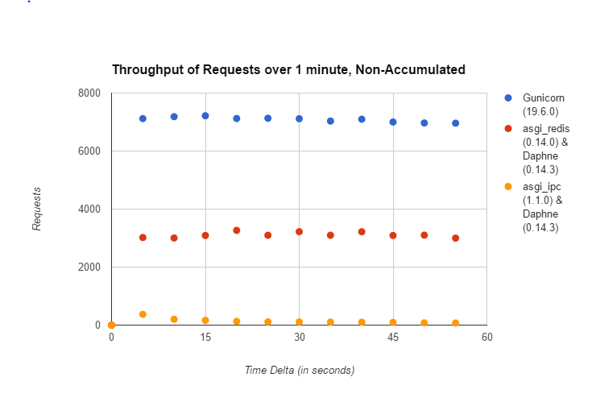

Django Channels Load Testing Results for (2016-09-06)
===============

The goal of these tests is to see how channels performs with normal HTTP traffic under heavy load with a control.

In order to control for variances, several measures were taken:

- the same testing tool was used across all tests, `loadtest <https://github.com/alexfernandez/loadtes/>`_.
- all target machines were identical
- all target code variances were separated into appropriate files in the dir of /testproject in this repo
- all target config variances necessary to the different setups were controlled by supervisord so that human error was limited
- across different test types, the same target machines were used, using the same target code and the same target config
- several tests were run for each setup and test type

Latency
~~~~~~~~~~~~

All target and sources machines were identical ec2 instances m3.2xlarge running Ubuntu 16.04.

In order to ensure that the same number of requests were sent, the rps flag was set to 300.

.. image:: channels-latency.PNG

Throughput
~~~~~~~~~~~~

The same source machine was used for all tests: ec2 instance m3.large running Ubuntu 16.04.
All target machines were identical ec2 instances m3.2xlarge running Ubuntu 16.04.

For the following tests, loadtest was permitted to autothrottle so as to limit errors; this led to varied latency times.

Gunicorn had a latency of 6 ms; daphne and Redis, 12 ms; daphne and IPC,  35 ms.

Supervisor Configs
~~~~~~~~~~~~

**Gunicorn (19.6.0)**

.. code-block:: bash

  [program:gunicorn]
  command = gunicorn testproject.wsgi_no_channels -b 0.0.0.0:80
  directory = /srv/channels/testproject/
  user = root
  
  [group:django_http]
  programs=gunicorn
  priority=999

**Redis (0.14.0) and Daphne (0.14.3)**

.. code-block:: bash

  [program:daphne]
  command = daphne -b 0.0.0.0 -p 80 testproject.asgi:channel_layer
  directory = /srv/channels/testproject/
  user = root
  
  [program:worker]
  command = python manage.py runworker
  directory = /srv/channels/testproject/
  user = django-channels
  
  
  [group:django_channels]
  programs=daphne,worker
  priority=999

**IPC (1.1.0) and Daphne (0.14.3)**

.. code-block:: bash

  [program:daphne]
  command = daphne -b 0.0.0.0 -p 80 testproject.asgi_for_ipc:channel_layer
  directory = /srv/channels/testproject/
  user = root
  
  [program:worker]
  command = python manage.py runworker --settings=testproject.settings.channels_ipc
  directory = /srv/channels/testproject/
  user = root
  
  
  [group:django_channels]
  programs=daphne,worker
  priority=999
